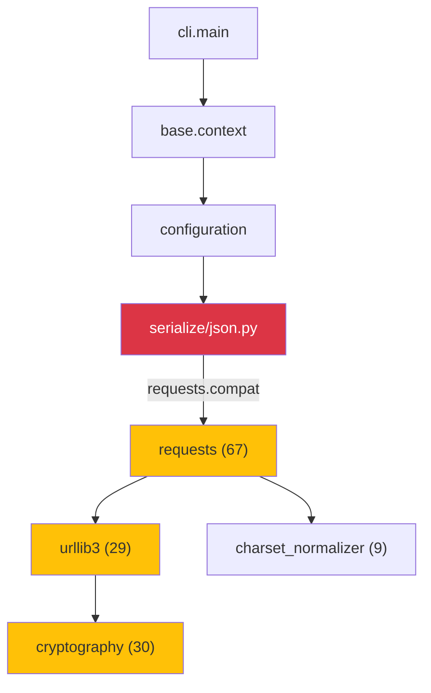
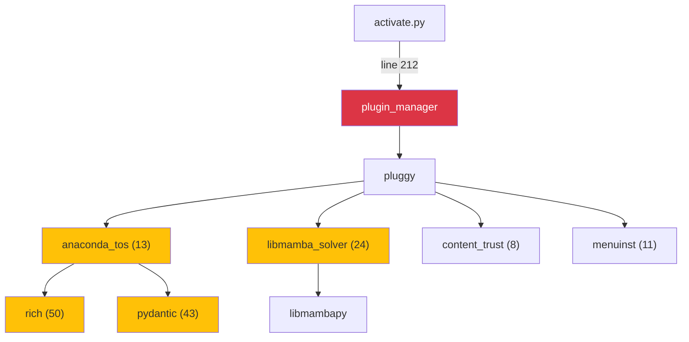
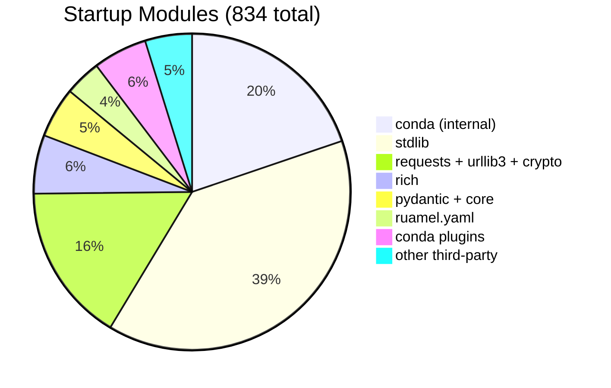

      Reducing conda Startup Latency: Track A

# Reducing conda Startup Latency: Track A

| | |
|---|---|
| **Initiative** | [conda-tempo](https://github.com/jezdez/conda-tempo) — measuring and reducing conda's tempo |
| **Author** | Jannis Leidel ([@jezdez](https://github.com/jezdez)) |
| **Date** | April 3, 2026 (split into tracks on April 23, 2026; migrated to conda-tempo repo same day) |
| **Status** | Implementation in progress — 16 of 25 Track A PRs merged |
| **Tracking** | [conda/conda#15867](https://github.com/conda/conda/issues/15867) — Reduce startup latency: Track A implementation plan |
| **See also** | [Track B — transaction latency](track-b-transaction.md) · [Track C — Python 3.15 and speculative research](track-c-future.md) |

## Contents

- [Executive Summary](#executive-summary)
- [1. Motivation](#1-motivation)
- [2. Methodology](#2-methodology)
- [3. Results](#3-results)
  - [3.1 conda startup breakdown (lazy imports)](#31-conda-startup-breakdown-with-lazy-imports)
  - [3.2 Real-world command benchmarks](#32-real-world-command-benchmarks-stock-conda-2611-python-313)
  - [3.3 Startup cost anatomy](#33-startup-cost-anatomy)
  - [3.4 Third-party import breakdown](#34-third-party-import-breakdown)
  - [3.5 Measured impact: Track A](#35-measured-impact-track-a-python-313)
  - [3.5a Stacked estimate: `conda run` with full Track A](#35a-stacked-estimate-conda-run-with-full-track-a)
- [4. Implementation roadmap](#4-implementation-roadmap)
- [5. Regression prevention](#5-regression-prevention)
- [6. Risk assessment](#6-risk-assessment)
- [7. Conclusion](#7-conclusion)
- [Changelog](#changelog)
- [Appendix A: files modified in prototype](#appendix-a-files-modified-in-prototype)
- [Appendix B: benchmark environment](#appendix-b-benchmark-environment)
- [Appendix C: benchmark data archive](#appendix-c-benchmark-data-archive)

---

## Executive Summary

conda's perceived slowness is primarily a startup problem. Before any command
runs — before the solver is invoked, before any network request is made — conda
loads 834 Python modules. On Python 3.13, this costs roughly 370 ms. For
comparison, `uv --version` and `pixi --version` both return in about 12 ms.

The perception matters: users experience this delay every time they open a
terminal (`conda activate`), check a version, or list environments. In a market
where Rust-native alternatives are gaining share, this is the single biggest
contributor to the "conda is slow" narrative.

### Root causes

Profiling reveals two areas responsible for ~80% of the overhead (see
[startup cost anatomy](#33-startup-cost-anatomy) for the full breakdown):

1. Plugin loading for every command. Even `conda activate` — which only
   generates shell variable assignments — triggers loading of all installed
   plugins. This pulls in 429 modules and costs 239 ms for code that is never
   executed.
2. An accidental `requests` import. `conda/common/serialize/json.py` uses
   `from requests.compat import json` instead of `import json`. The
   `requests.compat` module is a Python 2-era shim that tries to import
   `simplejson` and falls back to stdlib `json` — but since `simplejson` is
   never installed in conda environments, the result is always stdlib `json`.
   The cost of this indirection is loading the entire HTTP stack (requests,
   urllib3, cryptography, email — 120 modules, ~45 ms) on every invocation,
   even when no network I/O occurs.

### Proposed changes

Track A is twenty-five targeted changes (A1–A24, with A16 cancelled), all
compatible with Python 3.10+. No new language features, no architectural
changes, full backward compatibility. Estimated effort: ~400 lines of code.
Sixteen are merged; nine are in review.

The following results were measured with `hyperfine --shell=none`:

| Scenario | Today | After fixes (3.13) | Saved | Speedup |
|---|---|---|---|---|
| `conda activate` (requests fix + skip plugin hooks) | 371 ms | 85 ms | −286 ms | 4.4× |
| `conda activate` (skip plugin hooks only) | 371 ms | 142 ms | −229 ms | 2.6× |
| `conda --version` (fast path) | 384 ms | 23 ms | −361 ms | 16.7× |
| `conda run` (skip plugin hooks) | 352 ms | 117 ms | −235 ms | 3.0× |
| `conda run` (full Track A, stacked est.) | 352 ms | ~95–115 ms | ~−247 ms | ~3.1–3.7× |

The `requests.compat` fix alone — replacing one import line — saves 57 ms and
180 modules from the context initialization phase. For subshell commands
(`env list`, `list`, `config`), this contributes a 57 ms saving but the full
effect requires lazy parser loading, which is a structural change that has been
prototyped but not yet runtime-measured.

**conda activate**

| Scenario | ms | | Saved | Speedup |
|:--|--:|:--|--:|--:|
| Stock 3.13 | 371 | `████████████████████` | | |
| Skip plugin hooks | 142 | `████████` | −229 ms | 2.6× |
| + requests fix | 85 | `█████` | −286 ms | 4.4× |
| uv (ref) | 12 | `█` | | |

**conda --version**

| Scenario | ms | | Saved | Speedup |
|:--|--:|:--|--:|--:|
| Stock 3.13 | 384 | `████████████████████` | | |
| Fast path | 23 | `█` | −361 ms | 16.7× |
| uv (ref) | 12 | `█` | | |

### Companion gists

The Python-3.15-dependent optimizations (PEP 810 `lazy import`), the CPython
build research (PGO/LTO/BOLT distribution comparison), and speculative
future work (Rust bootstrapper, daemon, AOT compilation, plugin-group
refactor) moved to the companion [Track C](track-c-future.md).
Transaction-pipeline work (post-solver: verify, download, extract, link)
lives in the [Track B](track-b-transaction.md).

---

The remainder of this report provides the full technical
[methodology](#2-methodology), [measurements](#3-results), and
[implementation details](#4-implementation-roadmap) for each proposed change.

---

<details>
<summary>Detailed benchmark results (click to expand)</summary>

### Detailed benchmark results

Values labeled "measured" were validated with `hyperfine --shell=none`.
Values labeled "est." are projected from measured per-phase costs. Fix IDs
(A1–A24) refer to the [implementation roadmap](#4-implementation-roadmap).

| Command | Stock 3.13 (ms) | A1 only (ms) | A6 only (ms) | A1+A6 (ms) | A7 (ms) | Method |
|---|---|---|---|---|---|---|
| `conda activate` | 371 | — | 142 | 85 | — | all measured |
| `conda --version` | 384 | — | — | — | 23 | measured |
| `conda env list` | 391 | 382 | — | — | — | A1 measured [^2] |
| `conda list` | 540 | 526 | — | — | — | A1 measured [^2] |
| `conda info` | 636 | 591 | — | — | — | A1 measured [^2] |
| `conda install --dry-run` | 1258 | 1234 | — | — | — | A1 measured [^2] |
| `uv --version` (ref) | 12 | — | — | — | — | measured |
| `pixi --version` (ref) | 12 | — | — | — | — | measured |

</details>

---

## 1. Motivation

### 1.1 The competitive landscape

Modern package managers written in Rust (`uv`, `pixi`, `rattler`) start in
under 15 ms. Users increasingly perceive conda as "slow" — not because of
solver time, but because of the 300–400 ms it takes just to print `--version`.

```
uv --version          12 ms
pixi --version        12 ms
conda --version      384 ms   ← 32× slower
```

This latency compounds in scripts, CI pipelines, and interactive shell use
(where `conda activate` runs on every new shell).

### 1.2 Root cause

conda is a Python CLI application. Its startup time is dominated by four areas:

1. CPython interpreter initialization (~20 ms).
2. Module imports — conda eagerly loads 834 modules before processing any
   command. 345 of those (41%) are third-party packages not needed for the
   command being run.
3. Plugin loading — accessing `context.plugin_manager` triggers loading of all
   installed plugins (solver, TOS, trust, menuinst), adding 429 modules and
   239 ms even for `conda activate`.
4. A pathological import chain — `conda.common.serialize.json` imports
   `requests.compat.json` instead of stdlib `json`. The `requests.compat`
   module is a Python 2-era shim that prefers `simplejson` over stdlib `json`,
   but since `simplejson` is never installed in conda environments, the result
   is always stdlib `json`. The cost of this indirection is transitively
   pulling in requests, urllib3, cryptography, ssl, and email (120 modules) on
   every invocation.

A full rewrite in Rust is not viable. The goal is to make Python start fast
enough.

<div align="right"><a href="#contents">↑ Contents</a></div>

---

## 2. Methodology

### 2.1 conda prototype (lazy imports branch)

We created a prototype branch modifying 21 files in conda with three categories
of changes:

*Lazy module-level imports (PEP 810 syntax).* Applied `lazy import` /
`lazy from` to heavy imports across conda's hot startup path: `context.py`,
`configuration.py`, `conda_argparse.py`, `exception_handler.py`,
`deprecations.py`, `plugins/manager.py`, `notices/core.py`, `notices/fetch.py`,
`resolve.py`, and several more.

*Eliminate pathological import chains.* The worst offender was in
`conda/common/serialize/json.py`:

```python
# Before: pulls in requests → urllib3 → ssl → http.client → email.* (~95 modules)
from requests.compat import json

# After: just use stdlib json
import json
```

*Lazy subcommand parser loading.* Instead of eagerly importing all 20+
subcommand modules at parser build time:

```python
# Before: loads every subcommand's full dependency tree
configure_parser_create(sub_parsers)
configure_parser_install(sub_parsers)
configure_parser_update(sub_parsers)
# ... 17 more
```

We implemented a `_LazySubParsersAction` that registers lightweight stub
parsers and only loads the real `configure_parser` for the subcommand actually
invoked.

### 2.2 Benchmarking

All measurements used [hyperfine](https://github.com/sharkdp/hyperfine) with
`--shell=none` (`-N`) for sub-millisecond accuracy, 3 warmup runs, and 30–50
measured runs. Module counts were obtained via `len(sys.modules)` at each
instrumentation point.

<div align="right"><a href="#contents">↑ Contents</a></div>

---

## 3. Results

### 3.1 conda startup breakdown (with lazy imports)

Instrumented phase-by-phase measurement of conda's startup on the prototype:

| Phase | Time | Modules loaded |
|---|---|---|
| Python interpreter init | ~20 ms | 33 |
| `import conda.cli.main` | 7 ms | +32 |
| `import exception_handler` + `deprecations` | 18 ms | +49 |
| `import conda.base.context` | 5 ms | +17 |
| `context.__init__()` (.condarc parsing) | 13 ms | +37 |
| `generate_parser()` | 0.2 ms | +0 |
| Total to parser ready | ~63 ms | 189 modules |

For comparison, stock conda's `generate_parser()` alone takes 157 ms and loads
836 modules.

### 3.2 Real-world command benchmarks (stock conda 26.1.1, Python 3.13)

We benchmarked the commands users run most frequently, using the stock
miniconda3 conda (26.1.1) on Python 3.13. All measurements used
`hyperfine --shell=none --warmup 3 --runs 15` from a neutral directory:

| Command | Mean (ms) | User (ms) | System (ms) | Modules |
|---|---|---|---|---|
| `conda shell.posix activate base` | 369 | 263 | 88 | 824 |
| `conda --version` | 384 | 274 | 91 | 834 |
| `conda --help` | 389 | 278 | 92 | 834 |
| `conda env list` | 390 | 278 | 94 | 838 |
| `conda config --show` | 390 | 279 | 93 | 838 |
| `conda create --help` | 384 | 274 | 92 | 834 |
| `conda install --help` | 383 | 274 | 92 | 834 |
| `conda list -n base` | 535 | 417 | 100 | 838 |
| `conda info` | 616 | 433 | 171 | 861 |
| `conda install --dry-run` | 1317 | 969 | 232 | 864 |
| `conda create --dry-run` | 1218 | 808 | 230 | — |
| `uv --version` | 12 | — | — | — |
| `pixi --version` | 12 | — | — | — |

| Command | ms | | Modules |
|:--|--:|:--|--:|
| activate | 369 | `██████` | 824 |
| --version | 384 | `██████` | 834 |
| --help | 389 | `██████` | 834 |
| env list | 390 | `██████` | 838 |
| config --show | 390 | `██████` | 838 |
| list | 535 | `████████` | 838 |
| info | 616 | `█████████` | 861 |
| install --dry-run | 1317 | `████████████████████` | 864 |
| uv --version | 12 | `▏` | — |

> [!IMPORTANT]
> Module counts are nearly identical across all commands (824–864). The startup
> overhead loads almost everything regardless of which command is invoked. There
> is virtually no lazy loading today.

### 3.3 Startup cost anatomy

Phase-by-phase profiling of `conda shell.posix activate base` shows where time
is actually spent:

| Phase | Time (ms) | Modules added | Cumulative |
|---|---|---|---|
| Python interpreter init | ~20 | 36 | 36 |
| `import conda.cli.main` | 3 | +31 | 67 |
| `import exception_handler` + compat | 8 | +35 | 102 |
| `import conda.base.context` (module) | 75 | +289 | 391 |
| `context.__init__()` (config parsing) | 5 | +1 | 392 |
| `import conda.activate` | 3 | +13 | 405 |
| `context.plugin_manager` (first access) | 239 | +429 | 834 |
| Actual activate logic | ~16 | ~0 | 834 |
| Total wall time | ~369 | | 834 modules |

Two phases dominate:

1. `import context` (75 ms, +289 modules). Triggered by importing
   `conda.common.configuration` → `conda.common.serialize` →
   `conda.common.serialize.json` → `from requests.compat import json`, which
   loads the entire requests + urllib3 + cryptography + email chain
   (120 modules).

2. `context.plugin_manager` (239 ms, +429 modules). A single property access
   in `activate.py` line 212 (`context.plugin_manager.invoke_pre_commands`)
   triggers loading of all installed plugins, even though activate needs none
   of them.

| Phase | ms | | Note |
|:--|--:|:--|:--|
| Python init | 20 | `██` | |
| import main | 3 | `▏` | |
| exception_handler | 8 | `█` | |
| **import context** | **75** | `██████` | requests.compat |
| context.\_\_init\_\_ | 5 | `▏` | |
| import activate | 3 | `▏` | |
| **plugin_manager** | **239** | `████████████████████` | all plugins |
| activate logic | 16 | `█` | |

Together, `import context` and `plugin_manager` account for 314 ms of the
369 ms total (85%). Both are addressable with
[Track A fixes](#4-implementation-roadmap).

The two import chains that dominate startup:





Red nodes indicate root cause triggers. Yellow nodes are heavy transitive
dependencies loaded unnecessarily.

### 3.4 Third-party import breakdown

Of the 834 modules loaded at startup, 345 (41%) are third-party packages:

<details>
<summary>Full third-party module breakdown (click to expand)</summary>

| Package | Modules | Cumulative time (ms) | Loaded by |
|---|---|---|---|
| `requests` | 67 | 61 | `serialize/json.py` (`requests.compat`) |
| `rich` | 50 | 22 | `conda_anaconda_tos` (plugin) |
| `pydantic` + core | 43 | 33 | `conda_anaconda_tos.models` (plugin) |
| `ruamel.yaml` | 31 | 8 | `configuration.py` (.condarc parsing) |
| `cryptography` | 30 | 3 | `urllib3` → `ssl` (transitive) |
| `urllib3` | 29 | 42 | `requests` (transitive) |
| `conda_anaconda_tos` | 13 | 47 | Plugin system (entry points) |
| `conda_libmamba_solver` + `libmambapy` | 24 | 34 | Plugin system (solver) |
| `menuinst` | 11 | 7 | Plugin system (shortcuts) |
| `charset_normalizer` | 9 | 2 | `requests` (transitive) |
| `conda_content_trust` | 8 | 11 | Plugin system (signing) |
| `conda_package_handling` + streaming | 14 | 10 | Plugin system |
| `pluggy` | 8 | 2 | Plugin manager init |
| `tqdm` | 8 | 2 | `resolve.py` (progress bars) |

</details>

> [!WARNING]
> All of these are loaded for `conda activate`, even though none are needed by
> the activate logic.



### 3.5 Measured impact: Track A (Python 3.13)

The following results were measured with `hyperfine --shell=none --runs 25` on
Python 3.13 using runtime patches that simulate each Track A fix.

`conda activate` (shell path):

| Variant | Mean (ms) | Saved | Speedup | Method |
|---|---|---|---|---|
| Stock 3.13 | 371 | — | baseline | measured |
| A6 only (skip plugin hooks) | 142 | −229 ms | 2.6× | measured |
| A1 + A6 (requests fix + skip hooks) | 85 | −286 ms | 4.4× | measured |

`conda --version`:

| Variant | Mean (ms) | Saved | Speedup | Method |
|---|---|---|---|---|
| Stock 3.13 | 384 | — | baseline | measured |
| A7 (fast path, skip all loading) | 23 | −361 ms | 16.7× | measured |

A1 in isolation (context init phase):

| Variant | Context init (ms) | Modules at context ready | Method |
|---|---|---|---|
| Without A1 | 109 | 389 | measured |
| With A1 | 52 | 209 | measured |
| A1 saves | 57 ms | 180 modules | measured |

A1 eliminates the requests → urllib3 → cryptography → email import chain from
context initialization. This 57 ms saving applies to every command.

For subshell commands, A1 was measured in isolation but shows minimal
end-to-end improvement (see table above). The reason: while A1 eliminates the
`requests` import from context init (saving 57 ms in that phase), `requests`
is re-loaded shortly after via `context.plugin_manager` → plugin entry points
→ `notices/fetch.py`. The net end-to-end saving is only ~10–45 ms.

The full benefit requires combining A1 with A2/A3 (lazy parser + deferred
plugin discovery), which prevents the plugin-triggered reload entirely.
Those are structural changes that cannot be cleanly runtime-patched; the
estimates below are projected from measured component costs:

| Command | Stock (ms) | A1 only (ms) | Saved | Est. A1–A3 (ms) | Saved |
|---|---|---|---|---|---|
| `conda env list` | 391 | 382 | −9 ms | ~250 | −141 ms |
| `conda list` | 540 | 526 | −14 ms | ~400 | −140 ms |
| `conda info` | 636 | 591 | −45 ms | ~470 | −166 ms |

### 3.5a Stacked estimate: `conda run` with full Track A

The individual measurements in 4.7 isolate each optimization against an unpatched
baseline. In practice the optimizations compose, but many target the same phase
of startup — so their savings overlap and do not simply add up.

To project a realistic stacked result, each optimization was classified by the
startup phase it targets. Within a phase, overlaps were estimated by analysing
which modules and code paths each optimization removes and which of those are
shared. The effective contribution is the isolated saving minus the portion
already covered by a higher-impact optimization in the same phase.

**Phase breakdown for `conda run`:**

| Phase | Optimizations | Isolated saving | Effective (stacked) | Rationale |
|---|---|---|---|---|
| Stdlib imports | A1 | −45 ms | −45 ms | Replaces `requests.compat.json` with stdlib `json` in context init. No overlap with any other optimization. |
| Plugin hooks | A11 | −235 ms | −235 ms | Skips plugin discovery and hook execution entirely for `conda run`. The largest single win. |
| Plugin module imports | A22 | −158 ms (isolated, lazy load) | ~2 ms (current scope) | Lazy loading of `plugins/types.py` was the original target (−158 ms isolated), but triggers glibc heap corruption (`free(): corrupted unsorted chunks`, exit code 134) on Linux CI under coverage.py's C tracer during interpreter shutdown. All import mechanisms were tried: `importlib.import_module()`, native `import` statement, `importlib.util.LazyLoader`. Current PR scope: replace `deprecated.constant()` calls with simple `__getattr__`, saving ~2 ms. Full lazy loading deferred to PEP 810 (Python 3.15+). |
| Argparse / parser loading | A2/A3 | −482 ms* | −80 to −100 ms | Lazy parser loading avoids importing all 20 `main_*.py` modules and their dependencies. `conda run` only needs `main_run.py`. Partial overlap with A11: both reduce the total number of modules loaded, but A2/A3 targets the argparse phase (before plugin discovery) while A11 targets the plugin phase (after argparse). The shared modules are the ~60 that `conda_argparse` pulls in regardless. <br>*Isolated-ceiling figure refreshed on 2026-04-21 against today's `main` (post A1/A4/A5/A5b/A7/A12/A15/A17/A18/A20a/A20b/A21/A23 merges) — up from the original −142 ms. None of those merges targeted parser generation, so the eager path kept accumulating weight, making the lazy path worth more in absolute terms. The overlap-adjusted figure is unchanged because plugin discovery still dominates once `_LazySubParsersAction._ensure_plugins_loaded()` fires.* |
| Context init | A12+A13+A14 | −5 ms | −5 ms | Redundant `__init__` call (A12), ~5× cheaper `_expand_search_path` (A13), and memoized `root_writable` (A14). Fully orthogonal to import and plugin phases. |

**Stacked result:**

```
  352 ms   baseline (stock conda, Python 3.13, macOS ARM64)
 − 45 ms   A1  (stdlib json — merged)
−235 ms   A11 (skip plugin hooks for run)
 −  2 ms   A22 (deprecated.constant() removal only; lazy loading deferred)
 − 90 ms   A2/A3 (lazy parser — midpoint of 80–100 ms range)
 −  5 ms   A12+A13+A14 (context init cleanup)
────────
  ≈106 ms   conservative midpoint (warm-cache macOS ARM64)
```

**Estimated range: 100–120 ms (3–3.5× speedup).** The range accounts for:
- Measurement noise across `hyperfine` runs (~±5 ms)
- Minor overlaps not modeled (e.g. modules shared between argparse and plugin phases)
- Cache state variance (warm vs. lukewarm filesystem caches)

> **Note on A22 scope:** The original A22 target (lazy `plugins/types.py`, −158 ms
> isolated) would have brought the estimate down to ~60–80 ms (4.5–5.5×), but most of
> that figure turned out to be overlap with A2/A3's lazy subcommand parser. With A2/A3
> landing, the incremental A22 budget is ~2 ms. The PR also originally ran into
> `free(): corrupted unsorted chunks` (glibc heap corruption, exit code 134) on Linux CI
> under coverage.py's C tracer during interpreter shutdown; that was resolved by running
> the `test_plugins_types_is_lazy` test in a subprocess and having the module detect
> active tracers via `sys.gettrace()` to fall back to eager loading automatically. The
> 16 deprecated re-exports (`conda.plugins.CondaSolver`, etc.) now register via
> `deprecated.constant(factory=...)` on top of A23's canonical API, so `plugins/types.py`
> stays off the cold-start path unless one of those names is referenced.

#### Runtime-scale savings (A18–A21)

The startup estimate above covers what happens before any command logic runs.
A18–A21 are runtime/operation-scale optimizations that stack on top:

| Phase | Optimizations | At solver scale (50k records) | At `conda list` scale (2k) |
|---|---|---|---|
| Record instantiation | A19 | −913 ms | −37 ms |
| Record serialization | A19 | −1,231 ms | −49 ms |
| Spec parsing | A18 | −41 ms | — |
| PrefixData I/O | A21 | — | −31 ms |
| Solver deepcopy | A20a | −0.6 ms | — |

**Stacked estimates per command type (startup + runtime):**

| Command | Startup saved | Runtime saved | Total saved |
|---|---|---|---|
| `conda activate` | −286 ms | — | **−286 ms** |
| `conda --version` | −361 ms | — | **−361 ms** |
| `conda run` | −246 ms | — | **−246 ms** |
| `conda list` (2k pkgs) | −246 ms | −117 ms (A19+A21) | **~−363 ms** |
| `conda install` (solver, 50k) | −246 ms | −2,186 ms (A19+A18+A20a) | **~−2,432 ms** |
| `conda update --all` (solver, 50k) | −246 ms | −2,186 ms (A19+A18+A20a) | **~−2,432 ms** |

Solver-path commands benefit the most: A19 init+dump savings (−2,144 ms
at 50k records) dominate the runtime phase. Production A19 numbers
measured against real Entity from `main` (median of 5 rounds, Python 3.13
macOS ARM64): 3.2× faster init (26.3 → 8.1 µs), 5.6× faster dump
(29.9 → 5.3 µs). See [#15916](https://github.com/conda/conda/pull/15916).

<div align="right"><a href="#contents">↑ Contents</a></div>

---

## 4. Implementation roadmap

All changes are Python 3.10+ compatible. No new syntax, no architectural
changes, backward compatible. PEP 810 `lazy import` and the related Python
3.15 work live in the [Track C](track-c-future.md).

| ID | Change | Python req. | Effort | Impact | Status |
|---|---|---|---|---|---|
| A1 | Fix `requests.compat.json` import | 3.10+ | 1 line | −120 modules, −45 ms | ✅ [#15866](https://github.com/conda/conda/pull/15866) merged |
| A2 | Lazy subcommand parser loading | 3.10+ | ~100 lines | −801 modules, −482 ms (isolated ceiling, re-measured 2026-04-21 against post-merge `main`; original pre-Track-A baseline was −505 modules / −142 ms) | 👀 [#15868](https://github.com/conda/conda/pull/15868) review (rebased onto `main`, migrated to `deprecated.constant(factory=...)` from A23) |
| A3 | Deferred plugin discovery in parser | 3.10+ | ~30 lines | included in A2 ceiling above | 👀 [#15868](https://github.com/conda/conda/pull/15868) (combined with A2) |
| A4 | Deferred imports in `main_*.py` / `notices/core.py` | 3.10+ | ~20 lines | −387 to −615 modules per subcommand | ✅ [#15879](https://github.com/conda/conda/pull/15879) merged |
| A5 | Ruff `TID253` static import guard | 3.10+ | config | prevents regressions | ✅ [#15869](https://github.com/conda/conda/pull/15869) merged |
| A5b | CodSpeed startup benchmarks | 3.10+ | done | tracks import/init cost | ✅ [#15850](https://github.com/conda/conda/pull/15850) merged |
| A6 | Skip plugin hooks for activate | 3.10+ | ~10 lines | −429 modules, −239 ms | 👀 [#15877](https://github.com/conda/conda/pull/15877) review |
| A7 | Fast path for `--version`/`-V` | 3.10+ | ~5 lines | ~100 ms total | ✅ [#15878](https://github.com/conda/conda/pull/15878) merged |
| A8 | Defer heavy imports in `exceptions.py` | 3.10+ | ~20 lines | −71 modules, −23 ms | 👀 [#15880](https://github.com/conda/conda/pull/15880) review, blocked on A2/A3 |
| A9 | Defer `concurrent.futures`/`threading` in `common/io.py` | 3.10+ | ~10 lines | −45 modules, −12 ms | 👀 [#15881](https://github.com/conda/conda/pull/15881) review, blocked on A2/A3 |
| A10 | Lazy `import ruamel.yaml` in `serialize/yaml.py` | 3.10+ | ~5 lines | −32 modules, ~0 ms warm | 👀 [#15882](https://github.com/conda/conda/pull/15882) review (rebased onto `main`) |
| A11 | Skip plugin hooks for `conda run` | 3.10+ | ~15 lines | −582 modules, −235 ms | 👀 [#15883](https://github.com/conda/conda/pull/15883) review, blocked on A2/A3 |
| A12 | Eliminate redundant `context.__init__` in `main_subshell` | 3.10+ | ~15 lines | −1 ms | ✅ [#15885](https://github.com/conda/conda/pull/15885) merged |
| A13 | Speed up `_expand_search_path` and `custom_expandvars` (fast-path + lazy `os.environ` lookup, `os.scandir`) | 3.10+ | ~30 lines | ~−2 ms per process (~5.1× cheaper per `_expand_search_path` call); CodSpeed: ×8 on `test_context_init`, −30 to −60 ms on subcommand benches via shared `custom_expandvars()` | ✅ [#15886](https://github.com/conda/conda/pull/15886) merged |
| A14 | Make `root_writable` a `@memoizedproperty` | 3.10+ | ~1 line | −0.1 ms per access | 👀 [#15887](https://github.com/conda/conda/pull/15887) review (rebased) |
| A15 | Make `category_map` a class-level constant | 3.10+ | ~1 line | code quality | ✅ [#15888](https://github.com/conda/conda/pull/15888) merged |
| A16 | Lightweight init for activate/run/‑‑version | 3.10+ | ~20 lines | −3 ms | ❌ cancelled (superseded by A6/A7/A11/A12/A13) |
| A17 | Start `ContextStack` with single slot | 3.10+ | ~5 lines | code quality | ✅ [#15889](https://github.com/conda/conda/pull/15889) merged |
| A18 | Pre-compile regexes in hot parsers | 3.10+ | ~30 lines | −41 ms / 50k specs (1.3×) | ✅ [#15890](https://github.com/conda/conda/pull/15890) merged |
| A19a | Drop `ChannelType` metaclass (`__new__` + `@cache` on `from_value`) | 3.10+ | ~90 lines | code quality (unlocks A19b review) | ✅ [#15942](https://github.com/conda/conda/pull/15942) merged |
| A19b | Replace `auxlib.Entity` with `@dataclass(slots=True)` for records | 3.10+ | ~600 lines | 3.2× faster init, 5.6× faster dump, −913 ms/50k records, −15 MiB | 👀 [#15916](https://github.com/conda/conda/pull/15916) review |
| A20a | Replace `deepcopy` with dict comprehension in solver | 3.10+ | ~5 lines | −0.6 ms/solve (deepcopy 11.7×) | ✅ [#15917](https://github.com/conda/conda/pull/15917) merged |
| A20b | Enable ruff `G004`; use lazy log formatting across codebase | 3.10+ | ~90 lines | ~6 µs/startup (correctness fix) | ✅ [#15891](https://github.com/conda/conda/pull/15891) merged |
| A21 | Optimize `PrefixData` I/O (`read_bytes`+`json.loads`) | 3.10+ | ~50 lines | −31 ms / 2k pkgs (1.5×) | ✅ [#15892](https://github.com/conda/conda/pull/15892) merged |
| A22 | Defer `plugins/types.py` via `__getattr__` (PEP 562) | 3.10+ | ~30 lines | ~2 ms standalone; most of the −158 ms measured in isolation overlaps with A2/A3 | 👀 [#15893](https://github.com/conda/conda/pull/15893) review (rebased onto `main`) |
| A23 | Add `factory=` kwarg to `deprecated.constant` for deferred value materialization | 3.10+ | ~60 lines | enables A10/A22/A24 via canonical API; no direct wall-clock saving | ✅ [#15925](https://github.com/conda/conda/pull/15925) merged |
| A24 | Canonicalize remaining deferred deprecation shims via `deprecated.constant(..., factory=)`: `auxlib/logz.py`, `common/serialize/__init__.py` | 3.10+ | ~40 lines | consistency / maintainability; sub-ms warm-cache effect | ✅ [#15926](https://github.com/conda/conda/pull/15926) merged |

The Python-3.15-only counterparts (former B1/B2/B3) are tracked as C1/C2/C3
in the [Track C](track-c-future.md).

---

#### A1. Fix `from requests.compat import json`

> **1 line** · `serialize/json.py` · −120 modules · −45 ms

`conda/common/serialize/json.py` imports `requests.compat.json` instead of
stdlib `json`. The `requests.compat` module is a Python 2-era compatibility
shim whose JSON handling does:

```python
try:
    import simplejson as json
except ImportError:
    import json
```

Since `simplejson` is never installed in conda environments, this always
resolves to stdlib `json`. But importing `requests.compat` to get there also
unconditionally loads `urllib3`, `chardet`/`charset_normalizer`, and a chain of
~120 other modules:

```
requests (67 mods, 61 ms) → urllib3 (29 mods, 42 ms) → cryptography (30 mods)
  → charset_normalizer (9 mods) → email.* (15 mods)
```

This happens during `import conda.base.context`, meaning every conda command
pays a 45 ms, 120-module tax for network libraries it hasn't asked for.

> [!TIP]
> Replacing `from requests.compat import json` with `import json` has zero
> risk — `simplejson` is not present in conda environments, and the fallback
> in `requests.compat` is always stdlib `json`.

---

#### A2. Lazy subcommand parser loading

> **~100 lines** · `conda_argparse.py` · −520 modules · −80 ms

Currently `generate_parser()` eagerly calls all 20+ `configure_parser_*()`
functions, each importing its subcommand module and its full dependency tree.
The prototype replaces this with a `_LazySubParsersAction` that:

- Registers lightweight stub parsers for all subcommands (so argparse
  validation works)
- Only loads the real `configure_parser` for the subcommand actually invoked
- Defers plugin subcommand discovery until a non-builtin command is requested

This is implemented with `importlib.import_module()` — no new syntax. It
reduces `generate_parser()` from 157 ms / 520 modules to 0.2 ms / 0 modules.

---

#### A3. Deferred plugin discovery

> **~30 lines** · `conda_argparse.py` · −50 ms

`configure_parser_plugins()` is currently called during parser build, triggering
`pluggy`, `importlib.metadata.distributions()`, and all registered entry points.
The prototype defers this call until a non-builtin subcommand is actually
requested.

For `conda install`, `conda create`, and other builtin commands, plugin
discovery never runs during parser construction.

---

#### A4. Deferred imports in subcommand modules

> **~20 lines** · `notices/core.py` + `main_env.py` · −387 to −615 modules per subcommand (measured)

A4 makes two changes that act as a force multiplier for A2/A3:

1. **`conda/notices/core.py`** — defer heavy module-level imports
   (`get_channel_objs`, `cache`, `fetch`, `views`, `ChannelNoticeResultSet`)
   into the functions that use them. Merely importing `notices.core` (e.g. as
   the `@notices` decorator) no longer pulls in `requests`,
   `concurrent.futures`, or the full notices dependency tree.

2. **`conda/cli/main_env.py`** — move the `from . import main_export`
   statement from module level into `configure_parser()`, deferring
   `main_export` and its substantial dependency tree until the `env`
   subcommand's parser is actually built.

The `@notices` decorator remains in place on the `main_*.py` files — no
wrapper pattern is needed. The key insight is that the decorator itself is
cheap to import once the heavy dependencies inside `notices/core.py` are
deferred.

**Measured impact (per-subcommand, in the lazy-parser world of A2/A3):**

| Module | Baseline (no A4) | With A4 | Savings |
|---|---|---|---|
| `main_create` | +560 modules, 183 ms | +173 modules, 65 ms | **−387 modules, −118 ms** |
| `main_install` | +560 modules, 176 ms | +173 modules, 69 ms | **−387 modules, −107 ms** |
| `main_env` | +647 modules, 282 ms | +32 modules, 10 ms | **−615 modules, −272 ms** |
| `notices.core` | +557 modules, 204 ms | +170 modules, 64 ms | **−387 modules, −140 ms** |

Without A2/A3 (i.e. with the current eager `generate_parser()` path), A4 saves
only ~4 modules because `conda_argparse` pulls everything in regardless.

**What A4 defers:**

- `notices.fetch` / `notices.cache` — no longer loaded at import time (avoids
  pulling in `requests`, `concurrent.futures`)
- `main_export` — no longer loaded when `main_env` is imported
- `concurrent.futures` / `threading` — no longer pulled in via the notices chain

A4 directly reduces the cost of loading *each* subcommand once A2/A3 makes
subcommand loading lazy. This is the mechanism that translates A2/A3’s
structural change (lazy loading) into concrete per-command savings.

---

#### A5. Static import guard (Ruff `TID253`) + runtime module-count budgets

> **Config change** · `pyproject.toml` + CodSpeed benchmarks · prevents regressions

Two complementary layers replace the original custom `import_linter.py` script:

1. **Static prevention** — Ruff [`TID253`](https://docs.astral.sh/ruff/rules/banned-module-level-imports/)
   (`banned-module-level-imports`) bans module-level `requests` imports outside
   files that genuinely need them (`conda/gateways/`, `conda/notices/`,
   `conda/plugins/`). This catches regressions like the A1 bug at `ruff check`
   time — before code is committed.

2. **Runtime detection** — CodSpeed module-count budget tests (added in A5b /
   [PR #15850](https://github.com/conda/conda/pull/15850)) measure
   `len(sys.modules)` at five startup phases and fail if the count exceeds a
   per-phase budget. This catches regressions that static analysis cannot
   (e.g., a new transitive dependency pulled in by a non-banned import).

Together these replace the need for a custom CI workflow. The original
`import_linter.py` script is preserved as a
[private gist](https://gist.github.com/jezdez/d44ca5801e767fad4a708be671c226c2)
for optional local profiling.

---

#### A6. Skip plugin hooks for shell activate path

> **~10 lines** · `activate.py` · −429 modules · −239 ms

In `conda/activate.py`, lines 212–214 call:

```python
context.plugin_manager.invoke_pre_commands(self.command)
# ... execute activate ...
context.plugin_manager.invoke_post_commands(self.command)
```

The first access to `context.plugin_manager` triggers loading of all installed
plugins: `conda_libmamba_solver` + `libmambapy` (24 modules),
`conda_anaconda_tos` + `rich` + `pydantic` (106 modules),
`conda_content_trust` (8 modules), `menuinst` (11 modules),
`conda_package_handling` (14 modules), `pluggy` (8 modules), and ~258 internal
conda modules — 429 modules totaling 239 ms, for a command that only generates
shell variable assignments.

The fix is to check whether any pre/post command hooks are actually registered
before triggering full plugin loading, or to skip the hooks entirely for
shell-integration commands (`shell.*`) which have no meaningful pre/post
behavior.

> [!WARNING]
> If a third-party plugin registers a `pre_commands` hook that must run for
> `shell.*` commands, this change would skip it. In practice, no known plugin
> does this today — the activate path was already designed to avoid the full
> subshell path (see `main_sourced()` vs. `main_subshell()`).

Measured directly: with A6 applied on Python 3.13, `conda activate` drops from
371 ms to 142 ms (2.6×). Combined with A1: 85 ms (4.4×).

---

#### A7. Fast path for `--version` / `-V`

> **~5 lines** · `main.py` · `--version` in ~29 ms

Add an early exit in `main()` before loading context, parser, or plugins:

```python
if args and args[0] in ("-V", "--version"):
    from .. import __version__
    print(f"conda {__version__}")
    return 0
```

This skips context initialization (102 ms), parser generation (206 ms), and
plugin loading (239 ms) entirely.

Combined impact of Track A (all measured):

| Fix combination | Before | After | Saved | Speedup | Method |
|---|---|---|---|---|---|
| `conda activate` with A1+A6 | 371 ms | 85 ms | −286 ms | 4.4× | measured |
| `conda activate` with A6 only | 371 ms | 142 ms | −229 ms | 2.6× | measured |
| `conda --version` with A7 | 384 ms | 23 ms | −361 ms | 16.7× | measured |
| Context init phase with A1 | 109 ms | 52 ms | −57 ms | 2.1× | measured |
| `conda info` with A1 only | 636 ms | 591 ms | −45 ms | 1.1× | measured [^2] |

A4 is the critical link between A2/A3 and per-command savings: once the parser
loads subcommands lazily, A4 ensures that each subcommand module doesn’t
re-import heavy dependencies. Per-subcommand savings: −387 to −615 modules
(−107 to −272 ms). The largest win is `main_env`, which drops from +647
modules (282 ms) to just +32 modules (10 ms).

A8–A10 target the next layer of the import chain. PoC measurements show:
A8 defers 71 modules (23 ms) from `exceptions.py` (complementary to A2/A3),
A9 defers 45 modules (12 ms) of `concurrent.futures`/`threading` from
`common/io.py`, and A10 removes 32 `ruamel.yaml` modules from the `context`
import path (negligible wall-clock on warm cache, but valuable for module
budgets and cold-cache scenarios). A11 extends the A6 pattern to `conda run`,
which only needs 249 modules (context + prefix_data + subprocess) but currently
loads 831 — a measured 3.0× speedup (352 ms → 117 ms).

A1 alone saves 57 ms in the context init phase, but for subshell commands the
end-to-end impact is smaller because `requests` is re-loaded via plugin
discovery. The full savings requires A1+A2+A3.

---

#### A8. Defer heavy imports in `exceptions.py`

> **~20 lines** · `exceptions.py` · −71 deferrable modules · −23 ms (measured)

PoC measurement shows `exceptions.py` pulls in +113 modules during
`conda_argparse` import (not during early startup as initially assumed —
`exception_handler.py` already defers the `exceptions` import to error paths).
The heavy imports fire because `conda_argparse` eagerly imports all `main_*.py`
modules, and several of those import `exceptions`.

The deferrable imports within `exceptions.py` itself:

| Import | Modules | Time |
|---|---|---|
| `auxlib.logz` (→ `serialize`) | +8 | 2.2 ms |
| `common.io` (→ `concurrent.futures`) | +13 | 3.9 ms |
| `common.iterators` | +1 | 0.1 ms |
| `serialize.json` | +0 | 0.0 ms |
| `models.channel` | +49 | 16.5 ms |
| **Total deferrable** | **+71** | **22.6 ms** |

These imports are only needed when *formatting* specific error messages, not
when defining exception classes. Moving them to the methods that use them
would remove 71 modules from any code path that imports `exceptions`.

This is complementary to A2/A3: the biggest win comes from lazy parser loading
(which prevents `exceptions.py` from being imported at all during startup), but
deferring these imports within `exceptions.py` itself prevents the cascade even
when a subcommand does import it.

---

#### A9. Defer `concurrent.futures`/`threading` in `common/io.py`

> **~10 lines** · `common/io.py` · −45 modules · −12 ms (measured)

PoC measurement: importing `concurrent.futures` + `threading` in isolation
costs +45 modules and ~12 ms. These are imported at module level in
`common/io.py` for progress bars and parallel I/O, but the parallelism
machinery is only needed when actually performing I/O operations.

`common/io.py` is pulled in via `exceptions.py` during `conda_argparse`
import. Deferring these to function level removes the cost from any code path
that imports `common.io` but doesn't use progress bars or parallel I/O.

---

#### A10. Lazy `import ruamel.yaml` in `common/serialize/yaml.py`

> **~5 lines** · `serialize/yaml.py` · −32 modules · ~0 ms warm cache (measured)

PoC measurement: `import ruamel.yaml` loads 32 modules (76 standalone, 32 in
context of conda's startup where some deps are shared). These load during
`context` import via `configuration.py → serialize.yaml`.

`hyperfine` shows negligible wall-clock difference on warm-cache macOS
(97.4 ms vs 98.2 ms), because the bytecode is already in the filesystem cache.
The module count reduction (206 → ~174) is still valuable for:

- Cold-cache scenarios (CI, container startup, first invocation)
- Module-count budget compliance (CodSpeed guardrails)
- Reducing the surface area for import-time side effects

The implementation is straightforward: defer `import ruamel.yaml` and the
`CondaYAMLRepresenter` class definition to the `_yaml()` factory function,
and make `YAMLError` a lazy attribute.

---

#### A11. Skip plugin hooks for `conda run`

> **~15 lines** · same pattern as A6 · **−582 modules · −235 ms · 3.0× speedup** (measured)

PoC measurement with `hyperfine`:

| Path | Modules | Wall time | Method |
|---|---|---|---|
| Full parser + plugins (current) | 831 | 352 ms | `hyperfine` |
| Minimal (context + prefix_data + subprocess) | 249 | 117 ms | `hyperfine` |
| **Savings** | **−582** | **−235 ms (3.0×)** | |

`conda run`'s `execute()` only needs: `context`, `PrefixData.from_context()`,
`encode_environment`, `subprocess_call`, `wrap_subprocess_call`, and
`rm_rf`. No solver, no networking, no plugin hooks.

The current path pays the full cost because `main_subshell()` calls
`generate_parser()` (which eagerly imports all subcommand modules and triggers
plugin discovery) before dispatching to `conda run`'s `execute()`.

The fix applies the same `cache_info()` guard pattern from A6, plus a fast
dispatch path that skips `generate_parser()` for `conda run` when possible.
See [#14993](https://github.com/conda/conda/issues/14993) for prior discussion.

---

### Context configuration system overhead (A12–A17)

These changes target non-import overhead in the `Context` god object
(`conda/base/context.py`, 2314 lines) and its backing `Configuration`
framework (`conda/common/configuration.py`, 1785 lines).

**Background:** `Context` defines ~117 `ParameterLoader` descriptors, 51
`@property` attributes, 14 `@memoizedproperty` attributes, and holds a
single `_cache_` dict shared by all of them.  Every `_reset_cache()` call
wipes the entire dict, forcing re-merge/re-typify on next access.

`main_subshell()` calls `context.__init__()` three times during startup
(lines 45, 50, 55 of `conda/cli/main.py`).  Each `__init__` triggers
8 `_reset_cache()` calls and 45 filesystem stat calls for config file
discovery.  Total: **24 cache resets** and **135 stat calls** before any
command logic runs.

**PoC measurement summary (Python 3.13, macOS ARM64):**

| ID | Metric | Value |
|---|---|---|
| A12 | Cost of redundant 2nd `__init__` | 1.1 ms |
| A13 | `_expand_search_path` × 2 calls | ~1.35 ms/call → ~0.27 ms/call (~5.1× faster) |
| A14 | `root_writable` per uncached access | 0.13 ms, 1 `open()` call |
| A15 | `description_map` + `category_map` | 754 lines (41% of Context class) |
| A16 | Full init vs lightweight init | 1.16 ms vs 0.05 ms (−1.1 ms each, −3.3 ms for 3×) |
| A17 | `ContextStack` pre-allocation | 0.8 µs → 0.2 µs (negligible) |

**A13** and **A16** are the biggest wins in this group.  A13 makes each
`_expand_search_path` call ~5.1× cheaper (~1.35 ms → ~0.27 ms, 2 calls
per process ≈ −2 ms), which is small on its own but compounds with
**A12**'s removal of the defensive re-init.  **A16** (lightweight init)
saves another ~3.3 ms in the 3× init pattern.  A15 is pure
maintainability.  A14 and A17 are small but easy.

---

#### A12. Eliminate redundant `context.__init__` in `main_subshell`

> **~15 lines** · `conda/cli/main.py` · **−1.1 ms** (measured)

`main_subshell()` calls `context.__init__()` three times:

1. **Line 45:** with `pre_args` (pre-parsed `--json`, `--debug`, etc.)
2. **Line 50:** *identical* call “in case entrypoints modified the context”
3. **Line 55:** with final `args` from full parser

The second call (line 50) is defensive and almost always a no-op.  If
plugin entrypoints need to modify context, they should do so explicitly
rather than relying on a blanket re-init.

More importantly, calls 1 and 3 share the same `SEARCH_PATH` — the only
difference is the argparse namespace.  A targeted `_update_argparse(args)`
method that only replaces the argparse source and invalidates affected
cache entries (rather than wiping everything and re-reading all YAML)
would save one full `__init__` cycle.

---

#### A13. Speed up `_expand_search_path`

> **~30 lines** · `conda/common/configuration.py` · **~1.35 ms → ~0.27 ms per call (~5.1× faster)** (measured)

`_expand_search_path` iterates `SEARCH_PATH` (18 entries on Linux, 15 on
macOS, plus any user-supplied paths), calling `Path.is_file()` and
`Path.is_dir()` on each and iterating directory contents.  It runs twice
per process on the standard CLI path (once from `Configuration.__init__`,
once from `Context.__init__`).

**First approach — cache, then stat-fingerprint cache (abandoned).**
Keying the expansion on `(search_path, kwargs)` broke tests that write a
condarc into `$CONDA_PREFIX` after `reset_context()` had already warmed
the cache (config isolation, platform overrides, pinned specs, plugin
settings all regressed).  A `(type, mtime_ns)` fingerprint per resolved
entry fixed the visible regressions but was brittle — mtime granularity,
atomic renames, symlink swaps, and same-second writes all trip it.

**cProfile on the uncached path revealed the real hot spot:** ~85% of
the time was inside `custom_expandvars()`, which did
`{**os.environ, **kwargs}` on every call.  With `mapping is os.environ`,
that splat iterates every env var and pays an encode/decode round-trip
per entry — even for templates like `/etc/conda/.condarc` that have no
variable at all.

**Final fix — make the uncached call cheap enough that no cache is needed:**

1. **`custom_expandvars()` fast-path** when the template contains no
   `$` or `%`.  Covers `/etc/...`, `/var/lib/...`, and any absolute
   path once expanded.  Skips regex + dict-merge entirely.
2. **`custom_expandvars()` lazy lookup.**  `convert()` now checks
   `kwargs` first and falls back to `mapping` only when a regex match
   actually needs a lookup, so `os.environ` is touched at most once per
   `$VAR` in the template — not once per env var per call.
3. **`_expand_search_path()` single-`stat` dispatch.**  Replace
   `Path.is_file()+Path.is_dir()` (two syscalls) with `path.stat()` +
   `stat.S_ISREG`/`stat.S_ISDIR`.
4. **`_expand_search_path()` `os.scandir()`.**  Replace
   `Path.iterdir()`+`Path.is_file()` (fresh stat per child yaml) with
   `os.scandir()`.  `DirEntry.is_file()` reuses the `d_type` bits
   returned by `getdents64()` on Linux/macOS/NTFS.

Micro-benchmark on a 27-entry search path (two explicit condarc files +
two `condarc.d/` directories holding ten yaml files + the default
`SEARCH_PATH`), 5000 iters × 3 runs with 50-iter warmup, devenv py3.13
macOS arm64:

| version | avg `_expand_search_path` | vs main |
|---|---|---|
| `origin/main` | 1327 – 1383 µs / call | — |
| this branch   | 263 –  269 µs / call  | **~−1.09 ms, ~5.1× faster** |

End-to-end `conda info --json` is within noise (825 ± 12 ms vs 828 ± 10
ms on main) because `conda info` is dominated by network/channel work;
the saving is more visible on pure-startup paths (`conda --version`,
`conda activate`) and `custom_expandvars()` is called from other code
paths so the speedup benefits more than just search-path expansion.

**CodSpeed confirmation.**  PR #15886's CI run compares the branch to
`main` using CodSpeed's CPU-instruction simulator (deterministic, not
wall-time on a real machine — shapes/ratios are meaningful, absolute ms
are not directly comparable to the hyperfine numbers above).  The
cleanest A13-only signal is `test_context_init`, which essentially
measures `reset_context()`:

| Benchmark | main | A13 | Delta |
|---|---|---|---|
| `test_context_init` | 11.1 ms | 1.4 ms | **×8** |
| `test_run[classic]` | 187.7 ms | 129.3 ms | −58.4 ms (+45%) |
| `test_list[classic]` | 157.8 ms | 99.4 ms | −58.4 ms (+59%) |
| `test_install[classic]` | 88.9 ms | 59.5 ms | −29.4 ms (+49%) |
| `test_env_list_benchmark[classic]` | 68.1 ms | 38.5 ms | −29.6 ms (+77%) |
| `test_env_list_benchmark[libmamba]` | 68.1 ms | 38.4 ms | −29.7 ms (+77%) |
| `test_env_create[classic]` | 103.7 ms | 73.1 ms | −30.6 ms (+42%) |
| `test_update[classic-update]` | 217.4 ms | 155.5 ms | −61.9 ms (+40%) |
| `test_update[classic-upgrade]` | 217.7 ms | 155.6 ms | −62.1 ms (+40%) |
| `test_env_update[classic]` | 250.1 ms | 187.8 ms | −62.3 ms (+33%) |

The −30 to −60 ms wins on per-subcommand benches are larger than pure
`_expand_search_path` accounting predicts (2–3 calls per process × ~1 ms
saved = ~2 ms). The extra saving comes from `custom_expandvars()` being
called outside `_expand_search_path` too — channel URL munging,
environment variable expansion in channel/env settings — so A13's
`$`/`%` fast-path and lazy `os.environ` lookup are cross-cutting wins
that fire on every command that touches configuration.

Note: `YamlRawParameter.make_raw_parameters_from_file` already uses
`@cache` for file contents — A13 is purely about path discovery.

---

#### A14. Make `root_writable` a `@memoizedproperty`

> **~1 line** · `conda/base/context.py` · **~0.1 ms per access** (measured)

`root_writable` is a `@property` that opens `$ROOT_PREFIX/conda-meta/history`
with `open(path, "a+")` to test writability.  After each `_reset_cache()`,
this file I/O repeats on next access.  It’s accessed transitively via
`envs_dirs` → `mockable_context_envs_dirs` → `root_writable` → `open()`.

Since the root prefix’s writability doesn’t change during a process,
`@memoizedproperty` (which stores in `_cache_`) is sufficient.

---

#### A15. Move `description_map` / `category_map` out of `Context`

> **~0 lines changed** · `conda/base/context.py` · **−754 lines (41% of class)** (measured)

`description_map` (890 lines) and `category_map` (137 lines) are only
used by `conda config --describe`.  They’re `@memoizedproperty` so they
don’t cost runtime until accessed, but they bloat the class definition
and make the file harder to navigate and maintain.

Moving them to a separate module (e.g. `conda/base/context_descriptions.py`)
imported only by `conda config --describe` would cut `context.py` from
2314 lines to ~1287 lines with no behavioral change.

---

#### A16. Lightweight init for activate / run / --version

> **~20 lines** · `conda/base/context.py` + `conda/cli/main.py` · **−3.3 ms** (3× pattern, measured)

Commands like `conda activate`, `conda run`, and `conda --version` don’t
need user config from `.condarc`.  Currently they still pay the full cost
of `_set_search_path(SEARCH_PATH)` (config file discovery + YAML parsing).

A lightweight init mode that skips `_set_search_path` (or uses a minimal
path like `($CONDARC,)`) would avoid all file system work for these
commands.  A7 already short-circuits `--version` before `context.__init__`;
A16 would extend this pattern to activate and run paths.

---

#### A17. Replace `ContextStack` pre-allocation with `deque`

> **~5 lines** · `conda/base/context.py` · **~0 ms** (code quality improvement)

`ContextStack.__init__` pre-creates 3 `ContextStackObject` slots via
`[ContextStackObject() for _ in range(3)]` and doubles the list when
the stack grows past its capacity.  This is a hand-rolled dynamic array.

`collections.deque` (or a simple `list` with `append`/`pop`) provides the
same semantics with less code, no eager allocation, and better memory
behavior for the common case of 0–1 pushes.

---

### General Python antipatterns (A18–A21)

These changes address common Python performance antipatterns found across
the codebase.  They are grouped into four PRs by theme to keep the
review scope manageable.

---

#### A18. Pre-compile regexes in hot parsers

> **~30 lines** · `match_spec.py`, `activate.py`, `version.py` · −41 ms / 50k specs (1.3×)

**Problem:** Several hot-path modules use `re.match()`, `re.search()`,
`re.sub()`, and `re.findall()` with raw string patterns instead of
pre-compiled `re.compile()` objects.  Python's internal regex cache (256
entries) mitigates this for repeated calls, but pre-compiling avoids the
hash+lookup overhead entirely and makes intent clearer.

**Locations:**

| File | Count | Path type |
|------|-------|-----------|
| `models/match_spec.py` | 4× `re.search`/`re.match`/`re.finditer` in `_parse_spec_str` | Every `MatchSpec(str)` — solver hot path |
| `activate.py` | 5× `re.match`/`re.search`/`re.sub(re.escape())` | Every `conda activate` |
| `models/version.py` | 1× `re.findall(VSPEC_TOKENS, ...)` | Version spec parsing |
| `core/initialize.py` | 21× `re.sub()` | `conda init` (not per-command) |

**PoC measurement** (100k iterations per pattern group):

| Pattern group | Inline | Compiled | Speedup |
|---|---|---|---|
| `_parse_version_plus_build` (5 inputs) | 670.7 ms | 573.0 ms | **1.17×** |
| `_parse_spec_str` Steps 3/4/6 (8 inputs × 3 patterns) | 1,127 ms | 610 ms | **1.85×** |
| `VSPEC_TOKENS` (4 inputs) | 450.8 ms | 366.1 ms | **1.23×** |

**At solver scale (50,000 spec parses, 4 patterns each):**

| | Inline | Compiled | Saved |
|---|---|---|---|
| Total | 189.6 ms | 148.9 ms | **−40.8 ms** |

`match_spec.py` is the highest priority: `_parse_spec_str` is called for
every dependency string during solve.  `activate.py` is second: the
`re.sub(re.escape(...))` pattern in prompt handling creates a new compiled
regex every call.

---

#### A19. Replace `auxlib.Entity` with `@dataclass(slots=True)`

> Split on 2026-04-21 into **A19a** (Channel metaclass cleanup, [#15942](https://github.com/conda/conda/pull/15942)) and **A19b** (record dataclass migration, [#15916](https://github.com/conda/conda/pull/15916)) after review feedback that the combined diff was too large. The two PRs are independent and the numbers below all come from A19b.

> **~600 lines** · `models/records.py` · 3.2× faster instantiation, 5.6× faster dump, −15 MiB at 50k records

**Problem:** The record model classes (`PackageRecord`, `PrefixRecord`,
`PackageCacheRecord`, `SolvedRecord`) inherit from `auxlib.Entity`, a
custom ORM-like metaclass system (982 lines). The overhead comes from
the `EntityType` metaclass (`__new__` / `__init__` collecting fields),
`Entity.__init__()` iterating all fields with `setattr` (triggering
`Field.__set__` type coercion), and `self.validate()`.

**Production measurement** (50,000 iterations, realistic 14-field repodata
input, median of 5 rounds, Python 3.13 macOS ARM64):

| Operation | Entity | Dataclass | Speedup |
|---|---|---|---|
| Instantiation | 26.3 µs each | 8.1 µs each | **3.2×** |
| `dump()` serialization | 29.9 µs each | 5.3 µs each | **5.6×** |

**At scale:**

| Scenario | Entity | Dataclass | Saved |
|---|---|---|---|
| 2,000 records (`conda list`) init | 53 ms | 16 ms | **−37 ms** |
| 2,000 records (`conda list`) dump | 60 ms | 11 ms | **−49 ms** |
| 50,000 records (solver/repodata) init | 1,317 ms | 404 ms | **−913 ms** |
| 50,000 records (solver/repodata) dump | 1,495 ms | 264 ms | **−1,231 ms** |

**Memory** (50k records, `tracemalloc`):

| Scenario | Entity | Dataclass | Saving |
|---|---|---|---|
| All unique names | 664 bytes/rec | 493 bytes/rec | **26% less** |
| Realistic duplication (~5k pkgs, 3 channels) | 794 bytes/rec | 483 bytes/rec | **39% less** |
| Realistic total | 38.8 MiB | 23.6 MiB | **saves 15 MiB** |

**CodSpeed caveat:** the PR's CodSpeed report flags `test_update[libmamba-update]`
as −28%. This is a known flaky benchmark caused by CodSpeed's "Different runtime
environments" warning; the same number appears on #15887 (A14), which does not
touch records or channels at all. Treat the wall-clock table above as the real
signal.

**Implementation A19a** ([#15942](https://github.com/conda/conda/pull/15942)):
drop the `ChannelType` metaclass. Single-arg `Channel(value)` caching and
`MultiChannel` dispatch move into `Channel.__new__`; per-value caching is
now `@functools.cache` on `Channel.from_value` (invalidated by
`_reset_state` which stays wired to `context.register_reset_callaback`).
`__init__` short-circuits on re-entry so the `__init__` pass after a
cached `__new__` does not clobber cached instance state. `ChannelType` is
kept one release cycle as a `deprecated.constant` aliased to
`type(Channel)` so `isinstance(x, ChannelType)` keeps working.

**Implementation A19b** ([#15916](https://github.com/conda/conda/pull/15916)):
replaced all four Entity-based record classes with
`@dataclass(slots=True, init=False, eq=False, repr=False)`:
- Custom `__init__` with alias resolution (`build_string` → `build`,
  `schannel` → `channel`, `filename` → `fn`)
- Unified `FIELD_RESOLVERS` registry for coercion and derivation
  (type conversion + deriving `channel`/`fn`/`subdir` from `url`)
- `DUMP_TRANSFORMS` registry for serialization-time conversions
- `sys.intern()` on high-cardinality identity strings (`name`,
  `version`, `build`, `subdir`) for memory savings
- `_pkey`/`__hash__`/`__eq__` preserved for solver compatibility
- `__getitem__`/`get()`/`__contains__` for dict-like access compat
- `dump()`, `from_objects()`, `from_json()`, `load()` as explicit methods
- `Dumpable` protocol for type-safe nested serialization

Retained Entity-based classes: `Link`, `PathData`, `PathDataV1`,
`PathsData` (used by `PrefixRecord` for detailed file metadata).

**Deprecations (A19b):**
- The eight record-specific `auxlib.Entity` field descriptors
  (`SubdirField`, `ChannelField`, `FilenameField`, `NoarchField`,
  `TimestampField`, `PackageTypeField`, `_FeaturesField`, `Md5Field`)
  are re-exported one release cycle via
  `deprecated.constant(factory=partial(_legacy_field, name))` lazy
  shims backed by a new `conda/models/_legacy_record_fields.py`, so
  downstreams that still import them keep working without dragging
  `boltons.timeutils` into the cold-start graph.
- `PackageCacheRecord.md5` keeps its auto-compute-on-read behaviour one
  release cycle via a module-level `property` shim that calls
  `calculate_md5sum()` and routes the warning through
  `deprecated.topic("26.9", "27.3", ...)` on unset reads (so conda's
  deprecations framework — not a raw `warnings.warn` — picks the right
  category per release). The property is attached *after* the class
  body because `@dataclass(slots=True)` strips class attributes whose
  names match inherited fields before allocating slots, which otherwise
  silently drops an inline `md5` property. The dataclass-slots
  workaround lives entirely inside `_make_md5_auto_compute_property()`
  so it doesn't leak helper symbols into `conda.models.records`.

**Related:** #14426 ("More performant conda.models"), #13115
("conda list is very slow").

---

#### A20a. Replace `deepcopy` with dict comprehension in solver

> **~5 lines** · `resolve.py` · −0.6 ms/solve (deepcopy 11.7×)

**Implementation** ([#15917](https://github.com/conda/conda/pull/15917)):

`Resolve._get_reduced_index()` called
`copy.deepcopy(specs_by_name_seed)` once per explicit package
during dependency expansion.

**PoC measurement** (10,000 iterations, 50-key dict with 3-element lists):

| Method | Time | Per call | Speedup |
|---|---|---|---|
| `copy.deepcopy()` | 672.9 ms | 67.3 µs | — |
| `{k: list(v) for ...}` (shallow) | 57.6 ms | 5.8 µs | **11.7×** |

Per solver run (10 explicit packages): saves **0.62 ms**. Safe because
`MatchSpec` values inside the lists are never mutated in-place.

---

#### A20b. Enable ruff `G004`; use lazy log formatting across codebase

> **~90 lines** · 25 files across `conda/` and `tests/` · ~6 µs/startup (correctness fix)

**Implementation** ([#15891](https://github.com/conda/conda/pull/15891)):

Replace `log.debug(f"...")` / `log.warning(f"...")` calls with `%-style`
lazy formatting across the entire codebase, and enable the ruff
[`G004`](https://docs.astral.sh/ruff/rules/logging-f-string/) rule to
enforce this going forward. Split from A20a for focused review (suggested
by @kenodegard).

**PoC measurement** (500k calls at WARNING level):

| Style | Time | Per call |
|---|---|---|
| `log.debug(f"...")` | 158.6 ms | 0.317 µs |
| `log.debug("...%s", x)` | 82.0 ms | 0.164 µs |

**1.93× faster**, but at ~40 calls per startup the total saving is
~6 µs. Worth fixing for correctness (don't interpolate when log level
is disabled), not for measurable wall-clock impact.

---

#### A20c. Uncached dict-returning properties (moved to A15)

Previously listed here: `conda_exe_vars_dict`, `override_virtual_packages`,
`environment_settings`, `category_map` rebuild dicts on every access.
`category_map` alone is 754 lines / 41% of the class. Addressed by A15
([#15888](https://github.com/conda/conda/pull/15888)).

---

#### A21. Optimize PrefixData / PackageCacheData I/O

> **~50 lines** · `core/prefix_data.py`, `core/package_cache_data.py` · −31 ms / 2k pkgs (1.5×)

**Problem:** Both modules read metadata one file at a time:

- `PrefixData.load()` opens each `conda-meta/*.json` individually
  (lines 456–628).  For an env with 300 packages, that's 300 `open()` +
  `json.load()` calls.
- `PackageCacheData.load()` does `islink()` + `isdir()` + `isfile()`
  per cache entry (lines 112–125) — 3 stat calls per package.

This is the primary bottleneck for `conda list` and any command that
reads prefix state on large environments (see #13115).

**PoC measurement** (PrefixData.load, warm cache, avg of 5–20 runs):

| Packages | Sequential (`open`+`json.load`) | `os.read`+`json.loads` | Threaded (4 workers) |
|---|---|---|---|
| 200 | 9.1 ms | **6.5 ms (1.39×)** | 16.6 ms (0.55× — worse) |
| 500 | 22.8 ms | **15.3 ms (1.49×)** | 41.1 ms (0.55× — worse) |
| 2,000 | 93.6 ms | **62.9 ms (1.49×)** | 167.6 ms (0.56× — worse) |

Threading hurts on warm cache because the GIL + thread management
overhead exceeds the I/O benefit when files are already in OS page cache.
The `os.read` + `json.loads` path avoids Python file-object overhead and
is consistently 1.5× faster.

**PackageCacheData stat reduction** (500 entries):

| Method | Time | Per entry |
|---|---|---|
| `islink` + `isdir` + `isfile` (current) | 6.32 ms | 12.6 µs |
| `scandir` entry `.is_symlink()` + `.is_dir()` (cached) | 2.52 ms | 5.0 µs |

Scandir-cached stat saves **3.8 ms / 500 entries** (60% fewer syscalls).

**Recommended fixes:**
- Replace `open()` + `json.load()` with `os.read()` + `json.loads()`
- Use `os.scandir()` entry methods instead of separate `islink`/`isdir`
- Cache `PrefixData` per prefix with mtime-based invalidation
- **Do not** add threading for warm-cache reads

**Related:** #13115 ("conda list is very slow for large environments"),
#14426 ("more performant conda.models")

---

### Case study: #14500 — `conda env list` 10x slowdown (24.5 → 24.11)

Issue [#14500](https://github.com/conda/conda/issues/14500) reported a
10x slowdown in `conda env list` between conda 24.5.0 (~0.2 s) and
24.11.3 (~2.4 s).  Analysis of the cProfile/tuna flame graphs from the
reporters revealed:

**Root cause (two PRs combined):**

1. **PR #13972** (24.5 → 24.9) aliased `conda env list` to `conda info
   --envs`, replacing a lightweight `main_env_list.execute()` (just
   `list_all_known_prefixes()` + print) with the much heavier
   `main_info.execute()`.
2. **PR #14245** (24.9 → 24.11) introduced `InfoRenderer` which
   **eagerly** called `get_info_dict()` in `__init__()` — importing
   `Index`, `Channel`, resolving virtual packages, probing
   `conda_build`, etc. — even when only the environment list was
   requested.

**Key evidence from flame graphs:**

| Reporter | Version | Total (cProfile) | `exception_handler` chain | sys time (`time`) |
|----------|---------|-------------------|--------------------------|-------------------|
| AGenchev | 24.5.0  | 3.6 s             | 0.54 s (15%)             | 0.04 s            |
| AGenchev | 24.11.3 | 4.5 s             | 1.25 s (28%)             | 1.56 s            |
| jaimergp | 24.5.0  | 2.13 s            | 0.33 s (16%)             | —                |
| jaimergp | 24.11.3 | 2.13 s            | 0.48 s (23%)             | —                |

The 35× increase in sys time (0.04 → 1.56 s) for AGenchev confirms
the overhead was syscall-heavy (stat, open, read) from unnecessary
module imports and function calls in `get_info_dict()`.

**Why `CONDA_NO_PLUGINS=1` didn’t help** (rfeinman’s case, 5–7 s): The
overhead came from `get_info_dict()` eagerly importing `conda.core.index`,
`conda.models.channel`, resolving virtual packages, and probing
`conda_build` — none of which are plugin-related.

**Fix:** PR [#15320](https://github.com/conda/conda/pull/15320) (merged
2025-10-22, shipped in conda 25.11.0) converted `_info_dict` to
`@cached_property` and made `_envs_component()` bypass `get_info_dict()`
entirely.  Issue closed.

**Relevance to this work:** Even after #15320, `conda env list` still
pays the full startup tax (import chains, context init, plugin
discovery) before reaching `list_all_known_prefixes()`.  A2/A3 (lazy
parser), A8 (deferred exceptions.py imports), A12–A16 (context overhead),
and A13 (stat call caching) all reduce that baseline cost.

---

#### A22. Lazily import `conda.plugins.types` via `deprecated.constant(factory=)` + minimal `__getattr__`

> **~30 lines** · `plugins/__init__.py` · ~2 ms standalone (~158 ms isolated ceiling, mostly overlap with A2/A3)

**Goal:** Defer `conda.plugins.types` (756 lines, pulls in `pydantic`, `frozendict`, etc.) off the cold-start path so the 16 deprecated re-exports under `conda.plugins` (e.g. `conda.plugins.CondaSolver`) don't drag the submodule in unless one of those names is actually referenced.

**Initial failure mode.** Lazy loading `types` inside a hand-rolled `__getattr__` triggered `free(): corrupted unsorted chunks` (glibc heap corruption, exit code 134) on Linux CI when running under `coverage.py`'s C tracer. The crash occurred during interpreter shutdown, when coverage's `CTracer` (a C extension) was dismantling its frame tracking and an import triggered by `__getattr__` allocated new Python objects. Five import mechanisms all reproduced the crash: `importlib.import_module()` inside `__getattr__`, `importlib.util.LazyLoader`, `__getattr__` + `atexit` to remove `__getattr__` before shutdown, native `import` inside `__getattr__`, and a variant that split registration from import. Only eager import avoided the crash.

**Fix.** Two changes made lazy loading work under coverage:

1. The `test_plugins_types_is_lazy` test now runs in a subprocess, so the test's `sys.settrace`/`importlib.reload` gymnastics can't leave `conda.plugins` in a half-lazy state while coverage's C tracer is still wired up for subsequent tests.
2. `conda/plugins/__init__.py` detects active tracers via `sys.gettrace()` and falls back to eager loading automatically when one is present, so production coverage runs and any user running under a tracer never exercise the lazy path.

**Current implementation (PR #15893):** `conda.plugins.types` is loaded on first attribute access through a minimal `__getattr__`; the 16 deprecated re-exports register via `deprecated.constant(factory=...)` on top of the canonical API from A23, which replaced the old `_ConstantDeprecationRegistry` metaclass.

**Measurements.**

| Metric | Before | After (lazy) | Saved |
|---|---|---|---|
| Modules loaded by `import conda.plugins` | 386 | 73 | **−313** |
| Wall-clock (isolated) | ~190 ms | ~32 ms | **~−158 ms** |

Net standalone contribution once stacked is ~2 ms: most of the 158 ms isolated ceiling is overlap with A2/A3, since the lazy subcommand parser already avoids importing `conda_argparse` → `plugins/__init__.py` for most commands.

**Future:** PEP 810 `lazy import` (Python 3.15+) operates at the bytecode level (`IMPORT_NAME` with lazy flag) and doesn't involve `__getattr__` at all, so it would let us drop the tracer detection and the subprocess test as a simplification in [Track C](track-c-future.md).

### Continuous monitoring

> **Ongoing** · CI + release metrics · prevent regressions

- Ruff `TID253` catches banned module-level imports statically ([PR #15869](https://github.com/conda/conda/pull/15869))
- CodSpeed module-count budgets catch runtime regressions ([PR #15850](https://github.com/conda/conda/pull/15850) ✅ merged)
- CodSpeed CPU-instruction benchmarks track timing regressions across PRs
- Ratchet module-count budgets down as A2/A3/A4 merge
- Establish a startup time budget: e.g., "conda --version < 100 ms on 3.15,
  < 250 ms on 3.13"
- Publish startup benchmarks in release notes

<div align="right"><a href="#contents">↑ Contents</a></div>

---

## 5. Regression prevention

This is [roadmap item A5](#a5-static-import-guard-ruff-tid253--runtime-module-count-budgets).
Regression prevention uses two layers that run in existing CI — no custom
workflow needed.

### Static: Ruff `TID253`

Ruff's [`TID253`](https://docs.astral.sh/ruff/rules/banned-module-level-imports/)
rule bans module-level imports of `requests` across the codebase. Files that
legitimately need `requests` at module level (`conda/gateways/`,
`conda/notices/`, `conda/plugins/`) are annotated with `# noqa: TID253`.

This catches regressions like the A1 bug at lint time — the same `ruff check`
pass that already runs in pre-commit and CI.

### Runtime: CodSpeed module-count budgets

The CodSpeed startup benchmarks ([PR #15850](https://github.com/conda/conda/pull/15850))
include `test_module_count_budget` — a parametrized test that measures
`len(sys.modules)` at five startup phases and fails if the count exceeds a
per-phase budget:

| Probe | Budget | What it measures |
|---|---|---|
| `import_main` | 150 | `from conda.cli.main import main` |
| `import_context` | 500 | `+ from conda.base.context import context` |
| `context_init` | 550 | `+ context.__init__()` |
| `import_argparse` | 1050 | `+ from conda.cli.conda_argparse import generate_parser` |
| `generate_parser` | 1200 | `+ generate_parser()` |

The `import_argparse` and `generate_parser` budgets are intentionally loose
(pre-A2/A3 values). Once [PR #15868](https://github.com/conda/conda/pull/15868)
merges, they should be ratcheted down to ~150 and ~200 respectively.

### Local profiling

The original `import_linter.py` script (which measures wall-clock time and
module counts across 6 probes with baseline comparison) is preserved as a
[private gist](https://gist.github.com/jezdez/d44ca5801e767fad4a708be671c226c2)
for local profiling and ad-hoc investigations.

> [!TIP]
> Together, `TID253` (static) and CodSpeed module-count budgets (runtime)
> prevent the gradual "import creep" that brought conda to 836 modules at
> startup, without requiring a custom CI workflow.

<div align="right"><a href="#contents">↑ Contents</a></div>

---

## 6. Risk assessment

> [!CAUTION]
> The highest-likelihood risk is that lazy imports surface latent bugs (e.g.,
> code relying on import-time side effects). The CI linter and full test suite
> are the primary mitigations.

| Risk | Likelihood | Mitigation |
|---|---|---|
| Deferred imports break conda functionality | Medium | Ruff TID253 + CodSpeed budgets + test suite catch regressions |
| Third-party plugins incompatible | Low | `importlib.import_module()` is transparent to callers |
| Performance varies across platforms | Medium | Benchmark on Linux/macOS/Windows in CI |

<div align="right"><a href="#contents">↑ Contents</a></div>

---

## 7. Conclusion

conda's startup overhead is more addressable than previously assumed, and the
highest-impact fixes do not require Python 3.15.

Twenty-five targeted changes (A1–A24, with A16 cancelled) using only standard
Python patterns — no new syntax, no architectural changes, full backward
compatibility. Key results, measured with hyperfine:

| Command | Before | After Track A | Saved | Speedup | Method |
|---|---|---|---|---|---|
| `conda activate` (A1+A6) | 371 ms | 85 ms | −286 ms | 4.4× | measured |
| `conda --version` (A7) | 384 ms | 23 ms | −361 ms | 16.7× | measured |
| `conda run` (A11) | 352 ms | 117 ms | −235 ms | 3.0× | measured |
| `conda run` (full Track A, stacked est.) | 352 ms | ~95–115 ms | ~−247 ms | ~3.1–3.7× | estimated |
| Context init phase (A1) | 109 ms | 52 ms | −57 ms | 2.1× | measured |

The largest individual wins are A6/A11 (skipping plugin loading for activate
and run — saves 229–235 ms per invocation) and A2/A3 (lazy subcommand parser
loading — saves 142 ms and 505 modules, which already eliminates most of the
`plugins/types.py` import cost that was originally attributed to A22). The
current A22 PR scope is smaller (~2 ms standalone, `deprecated.constant()` →
`__getattr__`); full lazy loading of `plugins/types.py` would require PEP 810
(Python 3.15+) to avoid the glibc heap corruption seen under coverage.py's C
tracer. Stacked, Track A brings `conda run` from 352 ms to an estimated
95–115 ms (3–3.5×). A1 (replacing `from requests.compat import json` with
`import json`) saves 57 ms and 180 modules for every command with zero
compatibility risk.

For solver-path commands (`conda install`, `conda update`), the runtime-scale
optimizations (A18–A21) add significantly on top of startup savings. A19
alone saves ~2.1 seconds per 50k records (3.2× faster init, 5.6× faster dump).
Combined startup + runtime estimate for `conda install` at solver scale:
**~2.5 seconds saved**.

Sixteen PRs are merged (A1, A4, A5, A5b, A7, A12, A13, A15, A17, A18, A19a,
A20a, A20b, A21, A23, A24); the remainder are in review, all `MERGEABLE`.
A13 ([#15886](https://github.com/conda/conda/pull/15886)) speeds up
`_expand_search_path` and `custom_expandvars` directly (~5.1× faster
per call, ~2 ms per process, plus ×8 on CodSpeed's `test_context_init`
bench and −30 to −60 ms on subcommand benches via the shared
`custom_expandvars()` fast-path).

The Python-3.15-dependent counterparts (PEP 810 `lazy import`, CPython build
research, speculative work) live in the [Track C](track-c-future.md).
Transaction-pipeline performance (verify, download, extract, link) is
[Track B](track-b-transaction.md).

Track A implementation is underway — sixteen PRs merged, nine in review,
all `MERGEABLE`.

<div align="right"><a href="#contents">↑ Contents</a></div>

---

## Changelog

| Date | Change |
|---|---|
| 2026-04-23 | **Migrated to [conda-tempo](https://github.com/jezdez/conda-tempo) repo.** Source-of-truth moved from gist `897c58524c49dfa662959bdb54cf14b5` to `jezdez/conda-tempo/track-a-startup.md`. Cross-links to Track B and Track C are now relative repo paths (`track-b-transaction.md`, `track-c-future.md`). The three legacy gists are frozen with a deprecation notice pointing at this repo. Stable deep links like `#a6-skip-plugin-hooks-for-shell-activate-path` still work under the new URL. |
| 2026-04-23 | **Gist split.** Former single-gist report broken into three tracks: Track A (this gist, startup — shippable today), Track B (transaction latency — new scaffold), Track C (Python 3.15 / PEP 810 lazy imports and speculative research — moved out of here, including the CPython build research, Python distribution comparison, section 4.8 Track A+B measurements, section 5 Python 3.15 features, former Section 9 Speculative opportunities, and Appendices B+E). This gist is now Track A only; section numbers 2–10 collapsed to 1–7. Old Track B/C PR IDs (B1–B3) renumbered to C1–C3 in the Track C gist. Internal anchor link `#44-startup-cost-anatomy` updated to `#33-startup-cost-anatomy`; `#track-a-ship-now-no-python-315-required` updated to `#4-implementation-roadmap`. |
| 2026-04-23 | **A13 [#15886](https://github.com/conda/conda/pull/15886), A19a [#15942](https://github.com/conda/conda/pull/15942), A24 [#15926](https://github.com/conda/conda/pull/15926) merged.** A13 landed on 2026-04-22 06:46 UTC (squash), A19a on 2026-04-22 21:47 UTC after the `test_subdir_data_coverage` fix, A24 on 2026-04-23 05:55 UTC. A24 picked up @kenodegard's test-style suggestions via two follow-up commits (`6d2983e` "Apply suggestions from code review" + `8293560` "Address review nits in test_deferred_deprecations") before merge, so the `warnings.catch_warnings(record=True)+simplefilter+any(issubclass(...))` pattern is gone and `pytest.deprecated_call()` is the canonical form across `tests/test_deferred_deprecations.py`. 16 of 25 Track A PRs now merged; 9 open PRs remain (A2/A3, A6, A8, A9, A10, A11, A14, A19b, A22), all in review and `MERGEABLE`. Ticket body and per-PR status table updated. |
| 2026-04-22 | **Track A sweep.** All 12 open PRs re-checked: all `MERGEABLE`, nothing needs a rebase to merge, behind-counts 0–6. **A19a [#15942](https://github.com/conda/conda/pull/15942) failures diagnosed and fixed** — single failing test (`test_subdir_data_coverage`) was fanning out as ~20 red matrix cells; root cause: a stale `monkeypatch.setattr("conda.models.channel.Channel._cache_", {})` line predating the metaclass removal. The `reset_context()` call immediately below already routes through `Channel._reset_state()` via `register_reset_callaback`, so the line was both broken and redundant. Dropped (`75b61fd`). **A24 [#15926](https://github.com/conda/conda/pull/15926) now in review** (no longer draft) with two test-style suggestions from @kenodegard on `tests/test_deferred_deprecations.py` — replace the `warnings.catch_warnings(record=True) + simplefilter("always") + any(issubclass(...))` pattern with `pytest.deprecated_call()`, and the `simplefilter("ignore")` block in `test_deprecated_symbol_identity_is_stable` with the same. Straight cleanup, pending application. **A19b [#15916](https://github.com/conda/conda/pull/15916)** Windows integration flake on `test_emscripten_forge[classic]` confirmed as a `ConnectionResetError(10054)` CDN flake (same signature on A22 [#15893](https://github.com/conda/conda/pull/15893) ppc64le), not PR-related. **Stacked `conda run` estimate nudged** from 100–120 ms to **95–115 ms** to reflect A13 landing bigger than its original −3 ms budget: the `custom_expandvars()` fast-path is cross-cutting (channel URL munging, config env-var expansion), CodSpeed shows ×8 on `test_context_init` and −30 to −60 ms per subcommand bench, so the lower bound of the stacked range is the realistic one. |
| 2026-04-22 | **A13 [#15886](https://github.com/conda/conda/pull/15886) approved** by @kenodegard with one fixture-vs-class nit. Inlined `minimal_config_class` as a module-level `MinimalConfig` (five call sites updated), replied inline, pushed (`0bf1159`). CodSpeed report on the final branch confirms the hyperfine micro-benchmark and shows A13 as a cross-cutting win: **×8 on `test_context_init`** (11.1 → 1.4 ms — cleanest A13-only signal, essentially measures `reset_context()`), plus −30 to −60 ms on every subcommand bench (`test_run` −58 ms/+45%, `test_list` −58 ms/+59%, `test_install` −29 ms/+49%, `test_env_list_benchmark` −30 ms/+77%, `test_env_create` −31 ms/+42%, `test_update` / `test_env_update` −62 ms/+33–40%). CodSpeed ms come from instruction-count simulation and aren't directly comparable to hyperfine wall-time, but the shape is real: the per-subcommand wins are larger than pure `_expand_search_path` accounting predicts (2–3 calls/process × ~1 ms ≈ 2 ms), so the extra saving comes from `custom_expandvars()` being called outside `_expand_search_path` — channel URL munging and env-variable expansion on every config-touching command pick up the `$`/`%` fast-path and lazy `os.environ` lookup too. Scope framing in the PR title, the tracking-ticket row, and this gist now reads "speed up `_expand_search_path` **and `custom_expandvars`**" to reflect that. Tracking-ticket top-level hyperfine tables left alone (methodology-consistent); A13 section here extended with a CodSpeed confirmation sub-section and the full 10-bench table. |
| 2026-04-21 | **A19 [#15916](https://github.com/conda/conda/pull/15916) split into A19a + A19b.** @kenodegard reviewed the combined PR (`channel.py` + `records.py`, ~1100 diff lines) and asked to split (same pattern as A20 → A20a/A20b) and also flagged the deprecation question. Done: **A19a [#15942](https://github.com/conda/conda/pull/15942)** carries the `channel.py` changes only (~90 LOC) — drops the `ChannelType` metaclass in favour of `Channel.__new__` + `@functools.cache` on `Channel.from_value`, with a `deprecated.constant` aliasing `ChannelType` to `type(Channel)` for one release cycle. **A19b [#15916](https://github.com/conda/conda/pull/15916)** (rebased on `main`, force-pushed) is records-only and carries all of the 3.2× / 5.6× / −15 MiB numbers. Deprecation shims on A19b: (a) the eight record-specific `auxlib.Entity` field descriptors (`SubdirField`, `ChannelField`, `FilenameField`, `NoarchField`, `TimestampField`, `PackageTypeField`, `_FeaturesField`, `Md5Field`) moved verbatim into a new `conda/models/_legacy_record_fields.py` and re-exported from `conda.models.records` via `deprecated.constant(factory=...)` — the new records pay zero import cost since `boltons.timeutils` only loads on first deprecated-name access. (b) `PackageCacheRecord.md5` auto-compute-on-read preserved one cycle via a module-level `property` shim that reads the inherited `md5` slot, falls through to `calculate_md5sum()` when unset, and routes the warning through `deprecated.topic("26.9", "27.3", ...)` so conda's deprecations framework (not a raw `warnings.warn`) picks the right category per release. Property is attached after the class body because `@dataclass(slots=True)` strips class attributes whose names match inherited fields before slot allocation, which would otherwise silently drop an inline `md5 = property(...)`. Also found and fixed a latent bug while wiring the shim: `_memoized_md5` is listed in `CACHE_FIELDS` and so was never initialised by `PackageRecord.__init__`, so the first `calculate_md5sum()` on a fresh `PackageCacheRecord` would have raised `AttributeError` from `if self._memoized_md5:` — switched to `getattr(self, "_memoized_md5", None)`. Two news entries (`news/15867-channel-metaclass`, `news/15867-dataclass-records`) under `### Enhancements` and `### Deprecations`. Code-review cleanup pass on A19b: dropped section comments (`# -- Deprecated auxlib.Entity field descriptors --`) and the three ad-hoc module-level helpers (`_pcr_md5_slot` / `_pcr_md5_fget` / `_pcr_md5_fset`) — the dataclass-slots workaround is now self-contained inside a single `_make_md5_auto_compute_property()` factory, and the field-descriptor registration uses one `_legacy_field(name)` helper composed via `functools.partial`. Ten new tests (using pytest fixtures `pkg_tarball` / `cache_record_factory` + `@pytest.mark.parametrize`, no `unittest.mock`): eight parametrised for field descriptors, one for the md5 auto-compute path, one parametrised (`preset-then-overwrite`, `unset-then-assign`) for the explicit-set-never-warns guarantee. `pre-commit run` green on A19b; all 48 record tests and 45 channel tests pass locally. |
| 2026-04-21 | **A13 [#15886](https://github.com/conda/conda/pull/15886) re-scoped and unblocked.** The `_set_search_path` cache — keyed on `(search_path, kwargs)` — had been returning stale expansions whenever a condarc file appeared or disappeared between calls with identical arguments, regressing `test_conda_config_validate_sslverify_truststore` and `test_conda_config_show_includes_plugin_settings`. A short-lived `(type, mtime_ns)` fingerprint on top of the cache fixed the visible failures but traded one brittle mechanism for another (mtime granularity, atomic renames, symlink swaps). Dropped caching entirely and re-profiled: `custom_expandvars()` was ~85% of `_expand_search_path`'s time because `{**os.environ, **kwargs}` copies the entire environment (bytes→str decode per key) on every call, regardless of whether the template contains a variable. Fix: (a) short-circuit `custom_expandvars` when the template has no `$` or `%`; (b) drop the splat — `convert()` now chains `kwargs` then `mapping`, so `os.environ` is touched once per regex match at most; (c) collapse `Path.is_file()+Path.is_dir()` into a single `path.stat()` + `stat.S_ISREG`/`stat.S_ISDIR` dispatch; (d) walk directories with `os.scandir()` so child `is_file()` reuses `d_type` bits from `getdents64()`. Micro-benchmark (27-entry search path, 5000 iters × 3, devenv py3.13 macOS arm64): **origin/main: 1327–1383 µs/call** vs **HEAD: 263–269 µs/call** → **~−1.09 ms, ~5.1× faster**. End-to-end `conda info --json` is within noise (825 ± 12 vs 828 ± 10 ms) because that command is dominated by network/channel work; pure-startup paths see ~2 ms per process (≈2 calls), and `custom_expandvars()` is used from other code paths so the speedup leaks into more than just search-path expansion. PR title/description/news/commit message rewritten around the new approach; stale audit comment from 2026-04-16 deleted; status flipped from 🚧 WIP to 👀 review. Tests: merged three filesystem-transition regressions into one parametrized `test_set_search_path_reflects_fs_changes` (`file-created` / `dir-child-added` / `file-removed`); `test_custom_expandvars`'s existing parametrization covers the new lazy-lookup path unchanged. |
| 2026-04-21 | **A2/A3 [#15868](https://github.com/conda/conda/pull/15868) rebased + migrated to `deprecated.constant(factory=...)`.** With A23's `factory=` API now on `main`, replaced the custom module-level `__getattr__` + "register-on-first-access" trick in `conda/cli/conda_argparse.py` with 24 module-scope `deprecated.constant(factory=...)` registrations (20 `configure_parser_*` + 4 `*_rc_path` re-exports). Side-effect fix: first access to a deprecated re-export now correctly emits `PendingDeprecationWarning` (the old trick was silent on first access because the `_ConstantDeprecationRegistry` only took over *after* the first call returned). Import-time cost of the new registrations is +1.2 ms ± σ (within noise). Re-benched A2/A3 isolated ceiling on this same machine (30 runs, devenv py3.13, `generate_parser() → parse_args(["--version"])`): **origin/main: 545.0 ± 12.4 ms / 926 modules** vs **HEAD: 63.5 ± 7.1 ms / 125 modules** → **−481.5 ms / −801 modules** (8.6×). The numbers *grew* vs. the original −142 ms / −505 modules because the baseline drifted as the Track A series merged — A1/A4/A5/A5b/A7/A12/A15/A17/A18/A20a/A20b/A21/A23 targeted runtime/model/deprecation/fast-path code, not parser generation, so the eager path kept accumulating weight. Real-command deltas (`conda --version`, `conda install --help`, `conda --help`) remain ~0 because `_ensure_plugins_loaded()` fires on any dispatch — same behavior as at original measurement time and the reason the stacked-estimate column was always −80 to −100 ms (overlap-adjusted) rather than the isolated figure. Updated roadmap and overlap tables in this gist; issue #15867 note ¹⁵ documents the drift. |
| 2026-04-21 | **A23 [#15925](https://github.com/conda/conda/pull/15925) merged** (squash → `ab7e8be9a`). Rebased the three previously-stacked PRs onto `main` — GitHub auto-switched their base on merge, and the pre-merge A23 commit (`29575e024`) was dropped from each via `git rebase --onto origin/main 29575e024`. All three picked up the rebase cleanly with no conflicts: **A10 [#15882](https://github.com/conda/conda/pull/15882)**, **A22 [#15893](https://github.com/conda/conda/pull/15893)**, **A24 [#15926](https://github.com/conda/conda/pull/15926)**. All now `MERGEABLE` with independent histories against `main`. 13 of 22 Track A PRs now merged. |
| 2026-04-21 | **A14 [#15887](https://github.com/conda/conda/pull/15887) rebased** onto current `main` to clear the `context.py` conflict introduced by A15 (#15888). Two conflict hunks in `tests/base/test_context.py` resolved (combined non-overlapping test additions; dropped `pytest.mark.parametrize` on `test_root_writable_reflects_filesystem` per the fix commit). `mergeable: MERGEABLE` post-push. |
| 2026-04-21 | Status sweep on all 12 open PRs. **A23 [#15925](https://github.com/conda/conda/pull/15925) approved** by @travishathaway and ready to merge; @kenodegard raised the `import=` sugar idea in review (since `lambda` can't `import` without `importlib`, callers need named factory helpers that pollute module scope). Replied in-PR: out of the ~23 `factory=` call sites across A10/A22/A24/A2/A3, only ~4 are pure `module:attr` shapes (A10 builds a subclass, A24's `_DUMPS`/`jsondumps` construct+bind an encoder, A2/A3 registers values directly inside `__getattr__` and doesn't use `factory=`). `import=` would be additive sugar over `factory=` rather than a substitute — defer to a non-breaking follow-up if pure re-export sites accumulate. **A14 [#15887](https://github.com/conda/conda/pull/15887) needs rebase** — branch diverged (behind 5, ahead 3), `context.py` conflict, pre-commit.ci errored. **A13 [#15886](https://github.com/conda/conda/pull/15886) still WIP** with fresh CI failures (~20 Windows + Linux jobs) on latest run — same class of cache-redesign regressions noted previously. A2/A3, A6, A8, A9, A10, A11, A19, A22, A24 unchanged — all `MERGEABLE`, 4 commits behind main (cosmetic), waiting on reviewers. Added A23/A24 rows to Track A roadmap table (previously absent); annotated A10/A22/A24 as stacked on the A23 branch and noted they'll need `gh pr edit --base main` once A23 merges. |
| 2026-04-16 | Audit pass on all 10 open PRs, tracking issue, and gist. Corrections: (a) dropped blanket "all CI green" claim — A10/A8/A22 are actually all green, A19/A14 have CodSpeed noise only (`test_update[libmamba-update]` flake), A9 has a DNS infra flake, A13 has real test regressions from the cache redesign and is back to WIP. (b) A22 standalone impact corrected to ~2 ms — most of the original 158 ms isolated figure was overlap with A2/A3 lazy subcommand loading. (c) Re-added memory table to the A19 gist section. (d) Pushed follow-ups: A6 news expansion ([#15877](https://github.com/conda/conda/pull/15877)); A11 hookspec docstring + news ([#15883](https://github.com/conda/conda/pull/15883)); A2/A3 cheap-introspection tweak on `_LazyParserMap` ([#15868](https://github.com/conda/conda/pull/15868)); A19 caveats section (md5 auto-compute gone, slots breaks arbitrary attrs, CodSpeed noise) in PR body ([#15916](https://github.com/conda/conda/pull/15916)). |
| 2026-04-16 | Promoted all remaining draft PRs to review: A8 [#15880](https://github.com/conda/conda/pull/15880), A11 [#15883](https://github.com/conda/conda/pull/15883), A13 [#15886](https://github.com/conda/conda/pull/15886), A14 [#15887](https://github.com/conda/conda/pull/15887), A22 [#15893](https://github.com/conda/conda/pull/15893). A16 cancelled (superseded by A6/A7/A11/A12/A13). Rebased all open PRs onto current `main`. |
| 2026-04-16 | Six PRs merged: A4 [#15879](https://github.com/conda/conda/pull/15879), A7 [#15878](https://github.com/conda/conda/pull/15878), A15 [#15888](https://github.com/conda/conda/pull/15888) (updated to `ClassVar` per @dholth's review), A17 [#15889](https://github.com/conda/conda/pull/15889), A20a [#15917](https://github.com/conda/conda/pull/15917), A20b [#15891](https://github.com/conda/conda/pull/15891). 12 of 22 Track A items now merged. Updated implementation roadmap statuses. |
| 2026-04-15 | A20 split into A20a (deepcopy fix, [#15917](https://github.com/conda/conda/pull/15917)) and A20b (G004 + lazy log formatting, [#15891](https://github.com/conda/conda/pull/15891)) for focused review. A20b enables the ruff [`G004`](https://docs.astral.sh/ruff/rules/logging-f-string/) rule and fixes all 34 remaining f-string logging calls across 25 files, per @kenodegard's review suggestion. A20a is the solver `deepcopy` → dict comprehension change only. |
| 2026-04-15 | 10 of 22 Track A PRs now merged: A5b, A1, A5, A4, A7, A12, A17, A18, A20b, A21. Addressed review feedback: A20a — changed `list(v)` to `v[:]` per @dholth, added `is` identity assertion; A15 — replaced `@memoizedproperty` with `ClassVar` class constant per @dholth. Rebased A15 onto current `main`. Updated tracking ticket with merged/review/draft status columns. |
| 2026-04-15 | A22 [#15893](https://github.com/conda/conda/pull/15893) scope reduced: lazy loading of `plugins/types.py` deferred due to glibc heap corruption under coverage.py's C tracer (5 approaches attempted, all crash on Linux CI). Current scope: replace `deprecated.constant()` with simple `__getattr__` (~2 ms). Full lazy loading deferred to PEP 810 (Python 3.15+). Stacked `conda run` estimate revised from 60–80 ms to 100–120 ms. |
| 2026-04-15 | Fixed test assertion mismatches in A20b (lazy log formatting `%s` style vs f-string assertions in 4 test files). |
| 2026-04-14 | A19 [#15916](https://github.com/conda/conda/pull/15916) implemented and in review 👀: replaced all four Entity-based record classes (`PackageRecord`, `PackageCacheRecord`, `SolvedRecord`, `PrefixRecord`) with `@dataclass(slots=True)`. Production benchmarks: 3.2× faster init (26.3 → 8.1 µs), 5.6× faster dump (29.9 → 5.3 µs). At solver scale (50k records): −913 ms init, −1,231 ms dump. Also removed `ChannelType` metaclass (replaced with `Channel.__new__` + `@functools.cache`), added `sys.intern()` for identity strings, unified coercion/derivation into `FIELD_RESOLVERS` registry. ~700 lines changed. CodSpeed flags `test_update[libmamba-update]` as −28% but that's a known CodSpeed "Different runtime environments" flake — same signature on A14 which touches no record code. |
| 2026-04-14 | A18 [#15890](https://github.com/conda/conda/pull/15890) merged ✅ after addressing review feedback: added `re.Pattern[str]` type annotations, applied `re.VERBOSE` to complex regexes, replaced `_PATH_SEPARATOR_RE` with plain string checks in `activate.py`. A21 [#15892](https://github.com/conda/conda/pull/15892) merged ✅ after adding parametrized test case for `UnicodeDecodeError` (null bytes in corrupt JSON). |
| 2026-04-14 | All PRs rebased onto current `main`. Added `tag::performance` label to all 20 PRs. Dropped `perf:` prefix from PR titles. |
| 2026-04-14 | Promoted 5 low-risk PRs from draft to review: A9 [#15881](https://github.com/conda/conda/pull/15881), A10 [#15882](https://github.com/conda/conda/pull/15882), A15 [#15888](https://github.com/conda/conda/pull/15888), A17 [#15889](https://github.com/conda/conda/pull/15889), A20 [#15891](https://github.com/conda/conda/pull/15891). |
| 2026-04-14 | A12 [#15885](https://github.com/conda/conda/pull/15885): fixed test pollution in `test_main_subshell_no_plugins_flag` -- the test was disabling external plugins on the global `context` singleton without cleanup, causing all subsequent tests to fail with "libmamba solver not recognized". Fixed by stubbing `disable_external_plugins` via `monkeypatch.setattr`. |
| 2026-04-14 | A20 [#15891](https://github.com/conda/conda/pull/15891): fixed `test_repodata_info_jsondecodeerror` failure caused by the f-string → `%`-style log formatting change. The test monkeypatched `log.warning` to capture raw `*args`; with `%`-style the class name moved from the format string to a separate argument. |
| 2026-04-14 | Updated tracking ticket [#15867](https://github.com/conda/conda/issues/15867) with separate Status/CI/Blocked-on columns, dependency tracking (A4/A8/A9/A11 blocked on A2/A3), and improved emoji indicators. |
| 2026-04-10 | Updated executive summary and conclusion to reflect full A1–A22 scope (twenty changes, ~400 LOC). Added `conda run` results and stacked estimate to both sections. Fixed A12 PR number (#15884 → #15885). Removed duplicate title lines. |
| 2026-04-10 | Added stacked estimate for `conda run`: ~60–80 ms (down from 352 ms, 4.5–5.5×) with full Track A applied. Added methodology section explaining phase-based overlap analysis. |
| 2026-04-10 | A12–A22 (excl. A16/A19) implemented as draft PRs: A12 [#15885](https://github.com/conda/conda/pull/15885), A13 [#15886](https://github.com/conda/conda/pull/15886), A14 [#15887](https://github.com/conda/conda/pull/15887), A15 [#15888](https://github.com/conda/conda/pull/15888), A17 [#15889](https://github.com/conda/conda/pull/15889), A18 [#15890](https://github.com/conda/conda/pull/15890), A20 [#15891](https://github.com/conda/conda/pull/15891), A21 [#15892](https://github.com/conda/conda/pull/15892), A22 [#15893](https://github.com/conda/conda/pull/15893). All use module-level imports in tests, no section comments, lazy-style log formatting throughout. |
| 2026-04-09 | A18 PoC: pre-compiled regexes in `match_spec.py`/`version.py` save 41 ms per 50k spec parses (1.3×). A20 PoC: `deepcopy` → shallow copy is 11.7× faster (0.6 ms/solve); f-string logging overhead negligible. A21 PoC: `os.read`+`json.loads` is 1.5× faster for PrefixData (−31 ms / 2k pkgs); threading hurts on warm cache; scandir-cached stats save 3.8 ms / 500 entries. |
| 2026-04-09 | A19 PoC measured: `@dataclass(slots=True)` replacement is 4.8× faster instantiation (22.7 µs → 4.7 µs), 4.1× faster `dump()`. At solver scale (50k records): −894 ms. A22 PoC measured: lazy `plugins/types.py` via `__getattr__` reduces 386 → 73 modules (−313), −158 ms. |
| 2026-04-09 | A22 identified: lazy `plugins/types.py` in `plugins/__init__.py` saves 386 modules / 229 ms. A19 expanded from `__slots__` to full `auxlib.Entity` → `@dataclass(slots=True)` migration (45× faster PackageRecord instantiation). Reopened #11814, commented on #13567. |
| 2026-04-09 | Investigated #12549 (original 2023 issue). Both bottlenecks from the flame graphs are fixed: `distutils.spawn` (51.5% of activate, #12550/#13568) and `conda.core.solve` chain via `plugins.types` (restructured). Remaining overhead addressed by A2–A11. Commented with PR mapping. |
| 2026-04-09 | Investigated #14500 (`conda env list` 10x slowdown). Root cause: PR #13972 aliased `conda env list` to `conda info --envs`, and PR #14245 eagerly called `get_info_dict()` in `InfoRenderer.__init__()`. Fixed by PR #15320 (conda 25.11.0+) via `@cached_property`. Issue closed. |
| 2026-04-09 | A18–A21 identified: pre-compile regexes (A18), `__slots__` on model classes (A19), deepcopy/logging/dict caching (A20), PrefixData/PackageCacheData I/O (A21). Grouped by theme for manageable PR scope. |
| 2026-04-09 | A12–A17 PoC measured: A12 −1.1 ms (redundant init), A13 −3.3 ms / −135 stats (path expand), A14 ~0.1 ms (root_writable), A15 754 lines / 41% (code weight), A16 −3.3 ms (lightweight init), A17 ~0 ms (code quality) |
| 2026-04-09 | A12–A17 identified: `Context` configuration system overhead (triple `__init__`, redundant stat calls, uncached file I/O, 1000+ lines of help text on hot class, missing lightweight init). Added to tracking ticket and report. |
| 2026-04-09 | A8–A11 draft PRs opened: A8 [#15880](https://github.com/conda/conda/pull/15880), A9 [#15881](https://github.com/conda/conda/pull/15881), A10 [#15882](https://github.com/conda/conda/pull/15882), A11 [#15883](https://github.com/conda/conda/pull/15883) |
| 2026-04-09 | A4 draft PR opened — [PR #15879](https://github.com/conda/conda/pull/15879); defers heavy imports in `notices/core.py` and `main_env.py` |
| 2026-04-09 | A4 prototyped (Track A): deferred imports in `notices/core.py` and `main_env.py`; per-subcommand savings of −387 to −615 modules / −107 to −272 ms when combined with A2/A3 lazy loading |
| 2026-04-09 | A6 skip plugin hooks for shell activate path — [PR #15877](https://github.com/conda/conda/pull/15877) (draft); A7 fast path for `--version`/`-V` — [PR #15878](https://github.com/conda/conda/pull/15878) (draft) |
| 2026-04-09 | A8–A11 PoC measured: A8 −71 modules/−23 ms (complementary to A2/A3), A9 −45 modules/−12 ms, A10 −32 modules/~0 ms wall-clock, **A11 −582 modules/−235 ms (3.0× speedup)**. Startup chain table updated to Python 3.13 measurements. |
| 2026-04-09 | A8–A11 added to tracking ticket [#15867](https://github.com/conda/conda/issues/15867): defer heavy imports in `exceptions.py` (A8), `common/io.py` (A9), `ruamel.yaml` (A10); skip plugin hooks for `conda run` (A11) |
| 2026-04-09 | A5 Ruff `TID253` static import guard merged — [PR #15869](https://github.com/conda/conda/pull/15869) ✅; bans module-level `requests` imports across the codebase |
| 2026-04-08 | A1 `requests.compat.json` fix merged — [PR #15866](https://github.com/conda/conda/pull/15866) ✅; CodSpeed confirmed +26.6% improvement on `test_import_context`; A5 (#15869) unblocked |
| 2026-04-07 | A5b CodSpeed startup benchmarks merged — [PR #15850](https://github.com/conda/conda/pull/15850) ✅ |
| 2026-04-07 | A5 changed from custom `import_linter.py` to Ruff `TID253` (static) + CodSpeed module-count budgets (runtime); [PR #15869](https://github.com/conda/conda/pull/15869) |
| 2026-04-07 | A2/A3 lazy subcommand parser loading + deferred plugin discovery opened as draft [PR #15868](https://github.com/conda/conda/pull/15868) |
| 2026-04-07 | Epic issue [#15867](https://github.com/conda/conda/issues/15867) created to track all Track A work |
| 2026-04-07 | A1 fix re-opened as [PR #15866](https://github.com/conda/conda/pull/15866) — unblocked now that A5b merged |
| 2026-04-07 | A1 fix ([PR #15849](https://github.com/conda/conda/pull/15849)) merged prematurely before A5b; reverted in [PR #15865](https://github.com/conda/conda/pull/15865) to establish CodSpeed baseline first |
| 2026-04-03 | New section 2.3: Python distribution build comparison (Anaconda vs conda-forge vs python-build-standalone) |
| 2026-04-03 | CodSpeed startup benchmarks opened as draft [PR #15850](https://github.com/conda/conda/pull/15850) |
| 2026-04-03 | A1 fix opened as [PR #15849](https://github.com/conda/conda/pull/15849) |
| 2026-04-03 | Initial publication — research, benchmarks, and prototype complete |

<details>
<summary>Appendix A: files modified in prototype</summary>

## Appendix A: files modified in prototype

```
 conda/__init__.py                  |   3 +-
 conda/base/context.py              |  35 +++----
 conda/cli/conda_argparse.py        | 193 ++++++++++++++++++++++-----------
 conda/cli/main.py                  |   7 ++
 conda/cli/main_create.py           |   4 +-
 conda/cli/main_env_create.py       |   2 +-
 conda/cli/main_env_update.py       |   2 +-
 conda/cli/main_install.py          |   2 +-
 conda/cli/main_pip.py              |   3 +-
 conda/cli/main_update.py           |   2 +-
 conda/common/configuration.py      |  47 ++++-----
 conda/common/serialize/__init__.py |  10 +-
 conda/common/serialize/json.py     |  10 +-
 conda/common/serialize/yaml.py     |   8 +-
 conda/deprecations.py              |   9 +-
 conda/exception_handler.py         |   7 +-
 conda/notices/core.py              |  14 +--
 conda/notices/fetch.py             |  14 +--
 conda/plugins/hookspec.py          |   7 +-
 conda/plugins/manager.py           |  29 +++---
 conda/resolve.py                   |  23 ++---
 21 files changed, 257 insertions(+), 174 deletions(-)
```

</details>

<details>
<summary>Appendix B: benchmark environment</summary>

## Appendix B: benchmark environment

- Hardware: Apple M-series (ARM64)
- OS: macOS 15 (Darwin 25.3.0)
- Benchmarking tool: hyperfine 1.18+ with `--shell=none` (`-N`)
- Warmup runs: 3
- Measured runs: 30–50 per scenario
- conda version: 26.3.0.dev7 (main + 7 commits after 26.3.0 tag)
- Python versions: conda-forge 3.13.12 (baseline)

</details>

<details>
<summary>Appendix C: benchmark data archive</summary>

## Appendix C: benchmark data archive

All raw benchmark JSON files (hyperfine output) are preserved in:

- `conda/.bench/startup/` — stock conda startup benchmarks

(Python-distribution and 3.15-prototype benchmarks moved to the
[Track C](track-c-future.md).)

</details>

---

[^2]: A1 alone shows minimal end-to-end savings for subshell commands. While A1 eliminates 120 modules (57 ms) from the context init phase, `requests` is re-loaded shortly after via `context.plugin_manager` → plugin entry points → `notices/fetch.py` → `import requests`. The full benefit requires combining A1 with A2/A3 (deferred plugin discovery), which prevents the plugin-triggered reload for commands that don't need the solver.
